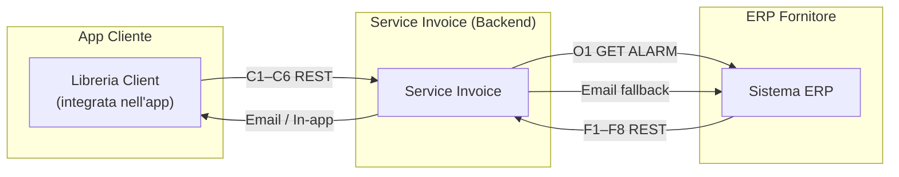
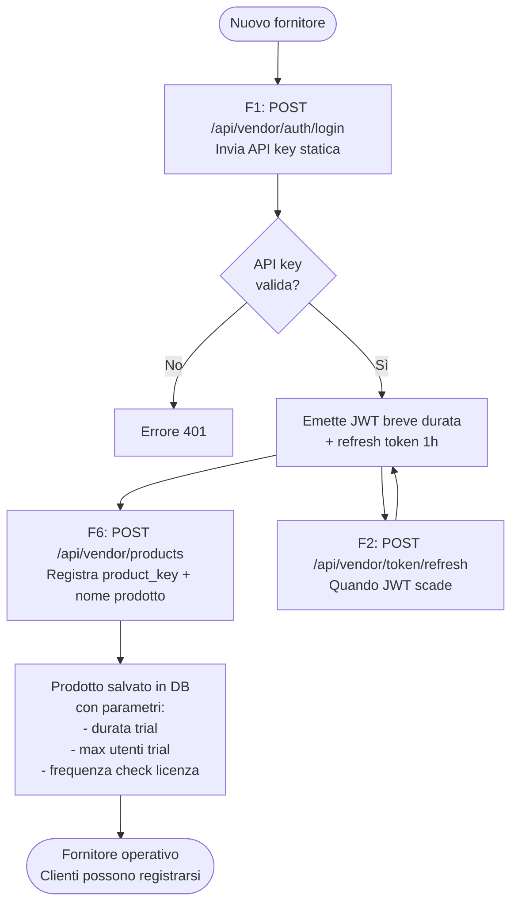
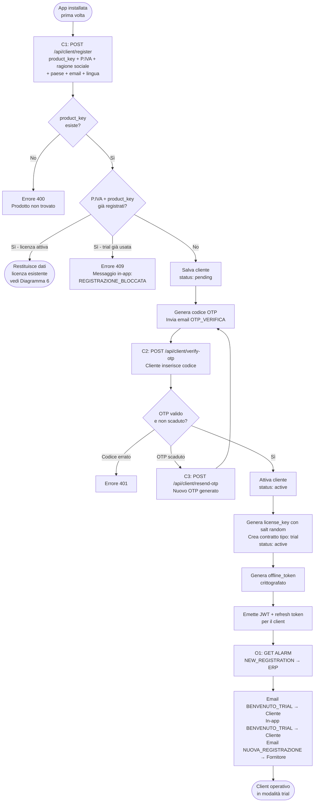
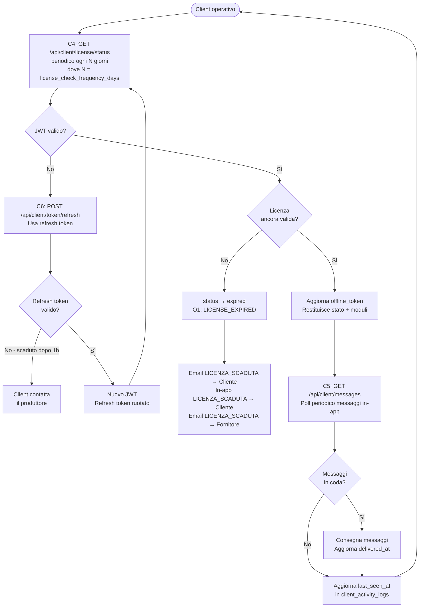
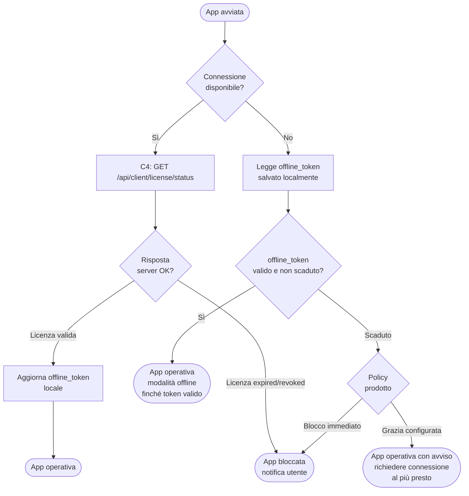
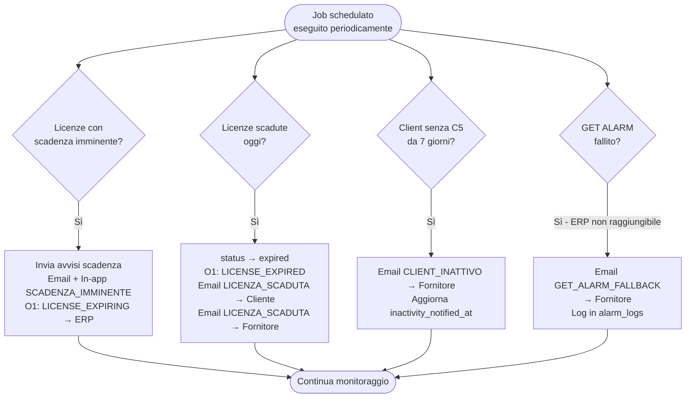

# Flowchart – Servizio Gestione Licenze

> Visualizzare in VS Code con l'estensione **Markdown Preview Mermaid Support**, oppure su GitHub / [mermaid.live](https://mermaid.live).

---

## Diagramma 1 — Architettura generale

---

## Diagramma 2 — Configurazione iniziale del fornitore

---

## Diagramma 3 — Registrazione cliente e attivazione trial

---

## Diagramma 4 — Funzionamento ordinario della licenza

---

## Diagramma 5 — Sincronizzazione fornitore e attivazione licenza a pagamento

---

## Diagramma 6 — Ciclo di vita della licenza e tipi

---

## Diagramma 7 — Validazione offline

---

## Diagramma 8 — Job schedulati e monitoraggio

---

## Diagramma 9 — Riapertura app da cliente già registrato

