# Flowchart – Servizio Gestione Licenze

> Visualizzare in VS Code con l'estensione **Markdown Preview Mermaid Support**, oppure su GitHub / [mermaid.live](https://mermaid.live).

> **Aggiornamento 09/06/2026 — Sezione 12 (decisione Alvise):**
> - Diagramma 3 aggiornato: C2 non chiama più O1 direttamente → imposta `vendor_synced = false`
> - Diagramma 4 aggiornato: C4 non fa più scattare O1/notifiche per licenze scadute
> - Diagramma 8 aggiornato: bootstrap scheduler con sistema eventi indipendenti dalle API
> - Diagrammi 10–13 aggiunti: struttura dati, registrazione job, esecuzione per ogni evento

> Per request body, controlli e risposte JSON di ogni endpoint vedere: **`Endpoint_Servizio_Gestione_Licenze_v5.md`**

---

## Diagramma 1 — Architettura generale

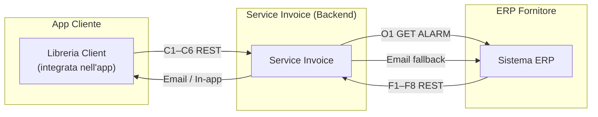

---

## Diagramma 2 — Configurazione iniziale del fornitore

---

## Diagramma 3 — Registrazione cliente e attivazione trial *(aggiornato — C2 disaccoppiata da O1)*

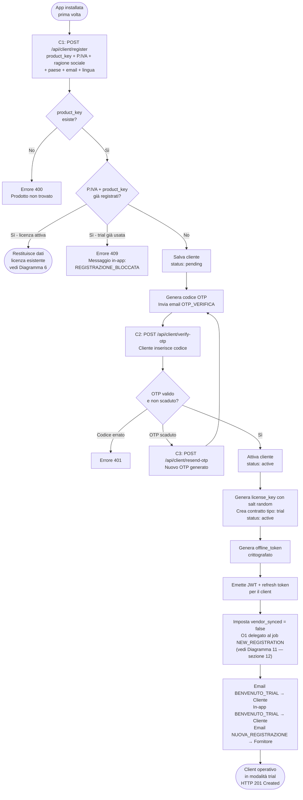

---

## Diagramma 4 — Funzionamento ordinario della licenza *(aggiornato — C4 non fa scattare O1)*

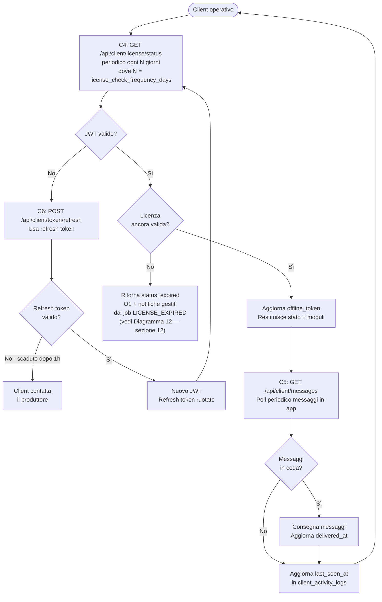

---

## Diagramma 5 — Sincronizzazione fornitore e attivazione licenza a pagamento

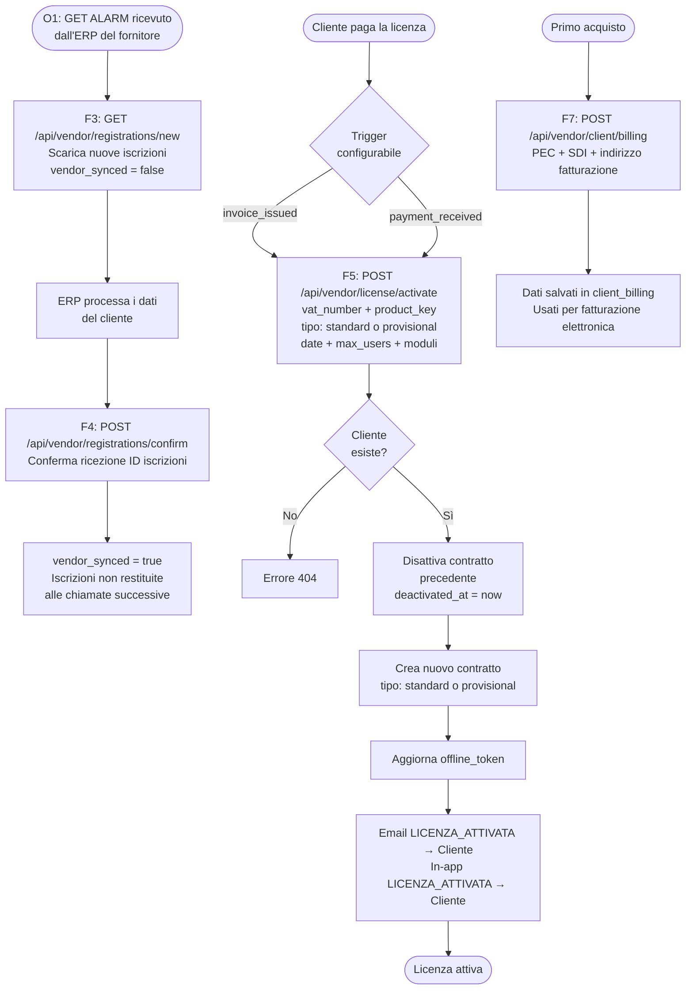

---

## Diagramma 6 — Ciclo di vita della licenza e tipi

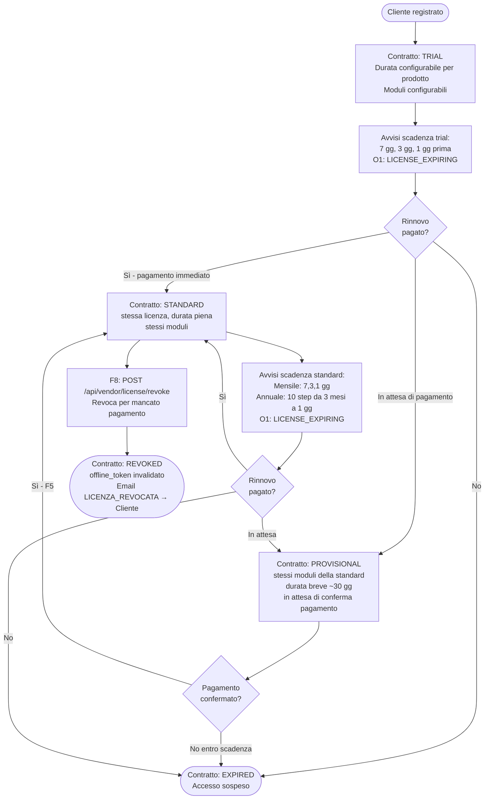

---

## Diagramma 7 — Validazione offline

---

## Diagramma 8 — Bootstrap scheduler: registrazione job per eventi attivi *(aggiornato — sezione 12)*

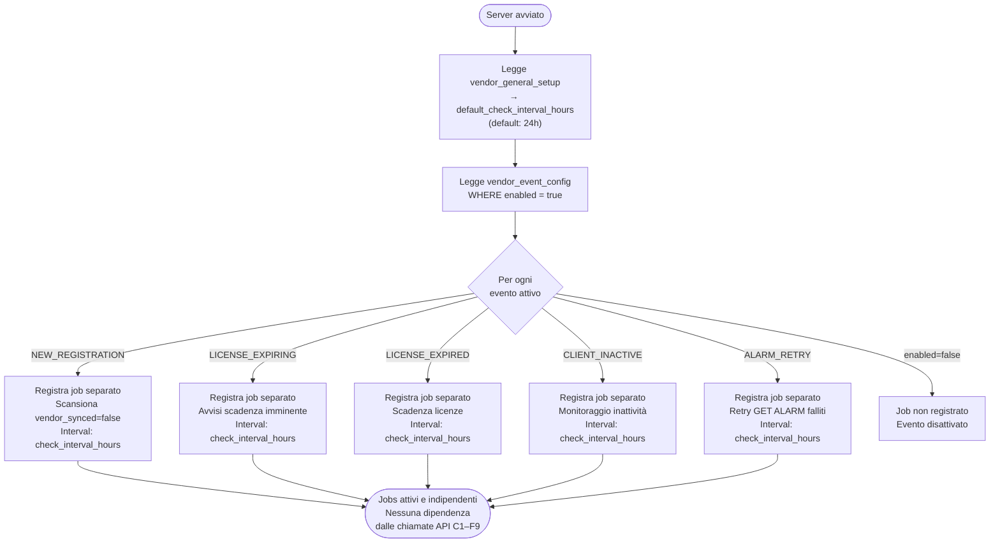

---

## Diagramma 9 — Riapertura app da cliente già registrato

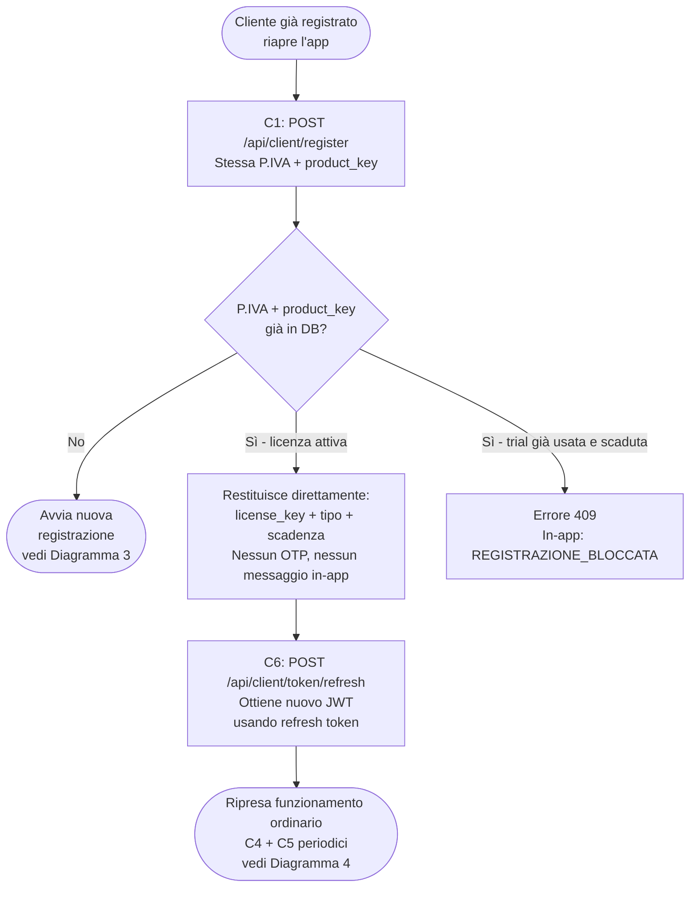

---

## Diagramma 10 — Struttura istanza multi-tenant: vendor, setup e configurazione eventi *(sezione 12)*

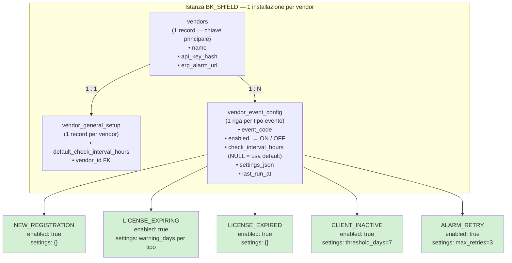

---

## Diagramma 11 — Esecuzione job: NEW_REGISTRATION e ALARM_RETRY *(sezione 12)*

```mermaid
flowchart TD
    subgraph JOB_NR["Job: NEW_REGISTRATION (ogni N ore)"]
        NR_S(["Avvio job"]) --> NR_Q["Query licenses\nWHERE vendor_synced = false"]
        NR_Q --> NR_C{"Record\ntrovati?"}
        NR_C -->|No| NR_END(["last_run_at = now\nFine"])
        NR_C -->|Sì| NR_L["Per ogni licenza:"]
        NR_L --> NR_O1["GET erp_alarm_url/alarm\nalarm_code = NEW_REGISTRATION"]
        NR_O1 --> NR_R{"ERP\n200 OK?"}
        NR_R -->|Sì| NR_OK["vendor_synced = true\nalarm_logs (success=true)"]
        NR_R -->|No| NR_F["alarm_logs\n(success=false, retry_count=0)\ngestito da ALARM_RETRY"]
        NR_OK & NR_F --> NR_END
    end

    subgraph JOB_AR["Job: ALARM_RETRY (ogni N ore)"]
        AR_S(["Avvio job"]) --> AR_R["Legge settings_json\n{max_retries: 3}"]
        AR_R --> AR_Q["Query alarm_logs\nWHERE success=false\nAND retry_count < max_retries"]
        AR_Q --> AR_C{"Record\ntrovati?"}
        AR_C -->|No| AR_END(["last_run_at = now\nFine"])
        AR_C -->|Sì| AR_L["Per ogni record:"]
        AR_L --> AR_O1["Retry O1\nstesso alarm_code e payload"]
        AR_O1 --> AR_R2{"ERP\n200 OK?"}
        AR_R2 -->|Sì| AR_OK["success = true\nlast_retry_at = now"]
        AR_R2 -->|No| AR_INC["retry_count++\nlast_retry_at = now"]
        AR_INC --> AR_M{"retry_count ==\nmax_retries?"}
        AR_M -->|Sì| AR_EMAIL["Email GET_ALARM_FALLBACK\n→ Fornitore\npermanently_failed = true"]
        AR_M -->|No| AR_END
        AR_OK & AR_EMAIL --> AR_END
    end
```

---

## Diagramma 12 — Esecuzione job: LICENSE_EXPIRING, LICENSE_EXPIRED, CLIENT_INACTIVE *(sezione 12)*

```mermaid
flowchart TD
    subgraph JOB_LE["Job: LICENSE_EXPIRING (ogni N ore)"]
        LE_S(["Avvio job"]) --> LE_R["Legge settings_json\nwarning_days per tipo licenza"]
        LE_R --> LE_Q["Query licenses\nexpires_at - now() IN warning_days\nAND notifica non ancora inviata per quella soglia"]
        LE_Q --> LE_C{"Trovate?"}
        LE_C -->|No| LE_END(["last_run_at = now\nFine"])
        LE_C -->|Sì| LE_L["Per ogni licenza:"]
        LE_L --> LE_O1["GET erp_alarm_url/alarm\nalarm_code = LICENSE_EXPIRING"]
        LE_O1 --> LE_EMAIL["Email SCADENZA_IMMINENTE → Cliente\nIn-app SCADENZA_IMMINENTE → Cliente"]
        LE_EMAIL --> LE_FLAG["Aggiorna flag notifica\nper la soglia corrente"]
        LE_FLAG --> LE_END
    end

    subgraph JOB_EXP["Job: LICENSE_EXPIRED (ogni N ore)"]
        EXP_S(["Avvio job"]) --> EXP_Q["Query licenses\nexpires_at < now()\nAND status != 'expired'"]
        EXP_Q --> EXP_C{"Trovate?"}
        EXP_C -->|No| EXP_END(["last_run_at = now\nFine"])
        EXP_C -->|Sì| EXP_L["Per ogni licenza:"]
        EXP_L --> EXP_UPD["status → expired\noffline_token invalidato"]
        EXP_UPD --> EXP_O1["GET erp_alarm_url/alarm\nalarm_code = LICENSE_EXPIRED"]
        EXP_O1 --> EXP_EMAIL["Email LICENZA_SCADUTA → Cliente\nEmail LICENZA_SCADUTA → Fornitore"]
        EXP_EMAIL --> EXP_END
    end

    subgraph JOB_CI["Job: CLIENT_INACTIVE (ogni N ore)"]
        CI_S(["Avvio job"]) --> CI_R["Legge settings_json\n{threshold_days: 7}"]
        CI_R --> CI_Q["Query clients\nlast_c5_at < now - threshold_days\nAND inactivity_notified_at IS NULL"]
        CI_Q --> CI_C{"Trovati?"}
        CI_C -->|No| CI_END(["last_run_at = now\nFine"])
        CI_C -->|Sì| CI_L["Per ogni client:"]
        CI_L --> CI_EMAIL["Email CLIENT_INATTIVO → Fornitore\nNessuna chiamata O1"]
        CI_EMAIL --> CI_FLAG["inactivity_notified_at = now()"]
        CI_FLAG --> CI_END
    end
```

---

## Diagramma 13 — Separazione API vs sistema eventi *(sezione 12)*

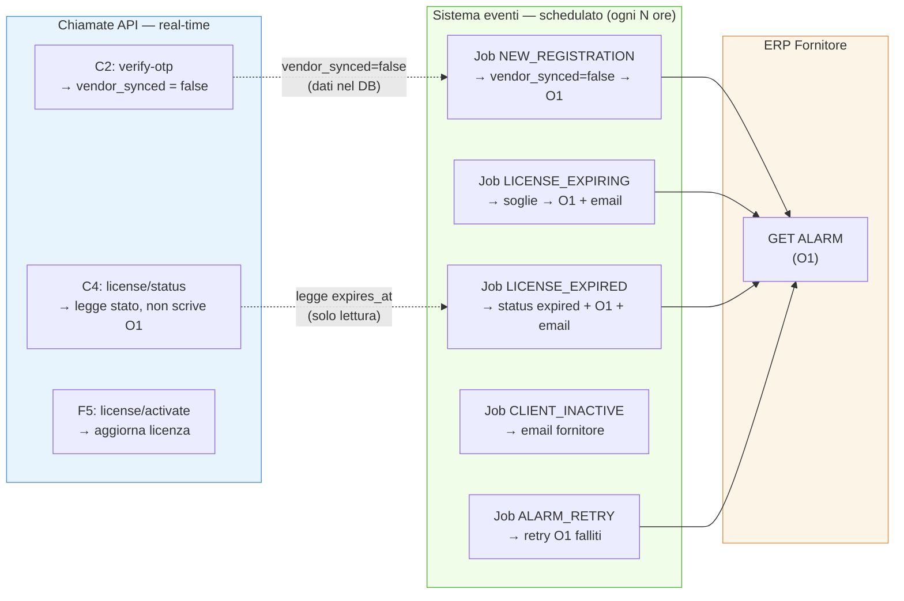
