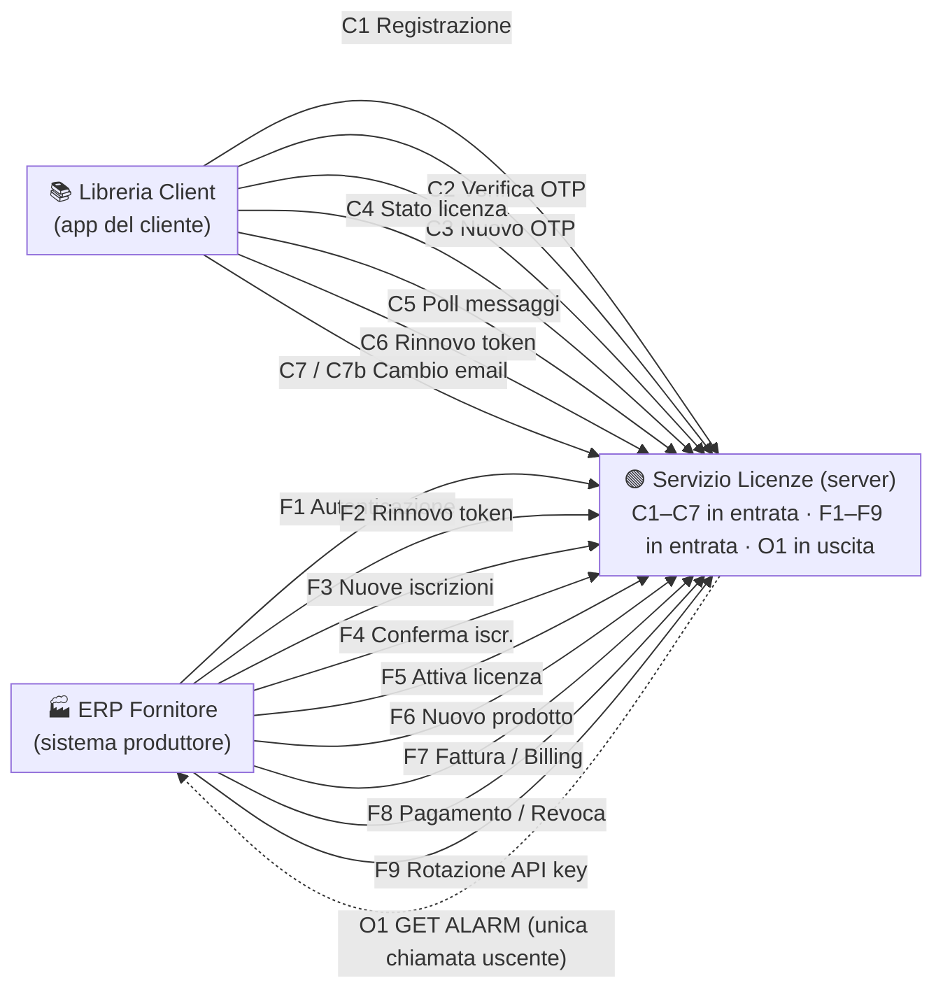

# Servizio Gestione Licenze — Specifica di implementazione

> **Versione:** 1.0 (INTEGRATO) · **Autori:** Pavan Andrea, Pavan Desirèe
> **Stack di riferimento:** Node.js + Express · SQLite · JWT RS256 · AES‑256‑GCM · bcrypt · node‑cron · Nodemailer · VIES
> Documento di riferimento per l'implementazione del back‑end. La numerazione dei paragrafi è progressiva (2.1 → 2.10).

---

## Indice

- [Setup & Struttura del progetto](#setup--struttura-del-progetto)
- [1. Panoramica generale](#1-panoramica-generale)
- [2. Descrizione dettagliata del funzionamento](#2-descrizione-dettagliata-del-funzionamento)
  - [2.1 Configurazione iniziale del produttore](#21-configurazione-iniziale-del-produttore) — `F1`, `F2`, `F6`
  - [2.2 Registrazione del cliente](#22-registrazione-del-cliente) — `C1`, `C3`, `C2`
  - [2.3 Funzionamento ordinario della licenza e modalità offline](#23-funzionamento-ordinario-della-licenza-e-modalità-offline) — `C4`, `C5`, `C6`
  - [2.4 Sincronizzazione con il produttore](#24-sincronizzazione-con-il-produttore) — `O1`, `F3`, `F4`
  - [2.5 Attivazione licenza a pagamento](#25-attivazione-licenza-a-pagamento) — `F5`
  - [2.6 Avvisi di scadenza e disattivazione automatica](#26-avvisi-di-scadenza-e-disattivazione-automatica)
  - [2.7 Licenza Provvisoria](#27-licenza-provvisoria) — `F7`, `F8`
  - [2.8 Caso eccezionale: tentativo di ri‑registrazione bloccato](#28-caso-eccezionale-tentativo-di-ri-registrazione-bloccato)
  - [2.9 Monitoraggio attività client e notifica inattività](#29-monitoraggio-attività-client-e-notifica-inattività)
  - [2.10 Riapertura dell'applicazione (cliente già registrato)](#210-riapertura-dellapplicazione-cliente-già-registrato)
- [3. Endpoint aggiuntivi (rif. Endpoint v5.1)](#3-endpoint-aggiuntivi-rif-endpoint-v51) — `C7`, `C7b`, `F7/billing`, `F8/revoke`, `F9`
- [4. Appendice tecnica — Tabelle DB e convenzioni](#4-appendice-tecnica--tabelle-db-e-convenzioni)

---

## Setup & Struttura del progetto

> Sezione operativa per avviare l'implementazione. La struttura di cartelle e i nomi degli script sono una **proposta** coerente con lo stack di riferimento (non vincolante): adattala alle convenzioni del team.

### Prerequisiti

- **Node.js** ≥ 18 LTS e **npm** ≥ 9
- **SQLite 3** (nessun server: file locale)
- Una coppia di chiavi **RSA** per la firma JWT RS256 (`keys/private.pem`, `keys/public.pem`)
- Accesso a un provider **SMTP** (o servizio email: SendGrid/Mailgun/Brevo) per l'invio reale delle email
- Connettività verso il servizio **VIES** della Commissione UE per la validazione P.IVA

### Dipendenze principali

| Ambito | Pacchetto suggerito |
|---|---|
| Web framework | `express` |
| Database / query builder | `better-sqlite3` **oppure** `knex` (+ driver `sqlite3`) |
| Migrazioni / seed | `knex` migrations & seeds |
| JWT (RS256) | `jsonwebtoken` **oppure** `jose` |
| Hash API key | `bcrypt` (rounds = 12) |
| Crittografia offline | modulo **`crypto`** nativo (AES‑256‑GCM, HMAC‑SHA256) |
| Validazione input | `joi` **oppure** `zod` |
| Rate limiting | `express-rate-limit` |
| Job schedulati | `node-cron` |
| Email | `nodemailer` |
| Template messaggi | `handlebars` |
| HTTP client (VIES / O1) | `axios` |
| Date / timezone | `dayjs` **oppure** `date-fns` |
| Documentazione API | `swagger-jsdoc` + `swagger-ui-express` |
| Test | `jest` + `supertest` |
| Config | `dotenv` |

### Struttura cartelle proposta

```text
.
├── README.md                     # questo documento
├── package.json
├── .env                          # variabili d'ambiente (NON committare)
├── .env.example                  # template variabili
├── knexfile.js                   # config migrazioni/seed (se si usa Knex)
├── keys/                         # chiavi RS256 — NON committare
│   ├── private.pem
│   └── public.pem
├── src/
│   ├── server.js                 # bootstrap: avvia Express + registra i job node-cron
│   ├── app.js                    # app Express: middleware globali, montaggio rotte, error handler
│   ├── config/
│   │   ├── env.js                # caricamento e validazione variabili .env
│   │   └── db.js                 # connessione/handle SQLite
│   ├── middleware/
│   │   ├── authClient.js         # verifica JWT + header X-License-Key (C4–C7)
│   │   ├── authVendor.js         # verifica JWT vendor (F1–F9)
│   │   ├── rateLimit.js          # express-rate-limit per endpoint pubblici
│   │   ├── idempotency.js        # gestione header Idempotency-Key (F5)
│   │   └── errorHandler.js       # formato errori standard (error_code/message/...)
│   ├── routes/
│   │   ├── client.routes.js      # C1, C2, C3, C4, C5, C6, C7, C7b
│   │   └── vendor.routes.js      # F1, F2, F3, F4, F5, F6, F7, F8, F9
│   ├── controllers/              # logica per endpoint
│   ├── services/
│   │   ├── crypto.service.js     # license_key (HMAC-SHA256+salt), offline_token (AES-256-GCM)
│   │   ├── jwt.service.js        # firma/verifica RS256 + refresh token rotation
│   │   ├── otp.service.js        # generazione/verifica OTP, lockout, tentativi
│   │   ├── vies.service.js       # validazione P.IVA/VAT (timeout + fallback vat_verified=false)
│   │   ├── mail.service.js       # invio email via Nodemailer
│   │   └── template.service.js   # rendering Handlebars da email_templates
│   ├── jobs/                     # node-cron (idempotenti, anti-duplicati via event_sent_log)
│   │   ├── index.js              # registrazione/scheduling dei job
│   │   ├── expiringNotices.job.js# avvisi Trial/mensile/annuale + O1 LICENSE_EXPIRING
│   │   ├── autoDeactivate.job.js # scadenza → status=expired + O1 LICENSE_EXPIRED
│   │   ├── newRegistration.job.js# O1 NEW_REGISTRATION (post C2)
│   │   ├── inactivity.job.js      # rilevamento inattività ≥ 7 giorni → CLIENT_INACTIVE
│   │   └── alarmRetry.job.js      # retry O1 (max 3) → fallback GET_ALARM_FALLBACK
│   ├── db/
│   │   ├── migrations/           # creazione tabelle (vedi § 4.3)
│   │   └── seeds/                # seed email_templates in it/en (tutti gli event_code)
│   └── docs/
│       └── swagger.js            # configurazione Swagger UI (/api-docs)
└── tests/                        # Jest + Supertest (unit, integration, e2e, mock ERP)
```

### Configurazione: `.env.example`

```dotenv
# Server
PORT=3000
NODE_ENV=development

# Database
DATABASE_FILE=./data/licenses.sqlite

# JWT (RS256)
JWT_PRIVATE_KEY_PATH=./keys/private.pem
JWT_PUBLIC_KEY_PATH=./keys/public.pem
JWT_TTL_SECONDS=60
REFRESH_TOKEN_TTL_SECONDS=3600

# Crittografia
LICENSE_KEY_HMAC_SECRET=cambia_questo_segreto
OFFLINE_TOKEN_AES_KEY=chiave_master_32_byte_in_hex_o_base64
BCRYPT_ROUNDS=12

# OTP
OTP_TTL_MINUTES=15
OTP_MAX_ATTEMPTS=3
OTP_LOCKOUT_MINUTES=30

# Rate limiting
RATE_LIMIT_REGISTER_PER_HOUR=5
RATE_LIMIT_RESEND_OTP_PER_HOUR=3
RATE_LIMIT_VENDOR_LOGIN_PER_HOUR=10

# VIES
VIES_API_URL=https://ec.europa.eu/taxation_customs/vies/services/checkVatService
VIES_TIMEOUT_MS=5000

# Email
EMAIL_PROVIDER=smtp
EMAIL_FROM="Servizio Licenze <noreply@example.com>"
SMTP_HOST=smtp.example.com
SMTP_PORT=587
SMTP_USER=
SMTP_PASS=

# Job schedulati
DEFAULT_CHECK_INTERVAL_HOURS=24
```

### Script `package.json` proposti

```json
{
  "scripts": {
    "dev": "nodemon src/server.js",
    "start": "node src/server.js",
    "migrate": "knex migrate:latest",
    "migrate:make": "knex migrate:make",
    "migrate:rollback": "knex migrate:rollback",
    "seed": "knex seed:run",
    "test": "jest",
    "test:watch": "jest --watch",
    "lint": "eslint src"
  }
}
```

### Avvio rapido

```bash
# 1. Dipendenze
npm install

# 2. Configurazione
cp .env.example .env            # quindi compila i valori

# 3. Chiavi RS256 per la firma JWT
mkdir -p keys
openssl genpkey -algorithm RSA -out keys/private.pem -pkeyopt rsa_keygen_bits:2048
openssl rsa -in keys/private.pem -pubout -out keys/public.pem

# 4. Database: migrazioni + seed dei template messaggi
npm run migrate
npm run seed

# 5. Avvio (i job node-cron partono col server)
npm run dev
```

### Note di implementazione

- **Job schedulati:** registrati in `src/jobs/index.js` e avviati da `server.js`; devono essere **idempotenti** e usare `event_sent_log` per evitare invii duplicati. Gestire correttamente il **timezone** dei `TIMESTAMP` SQLite (dayjs/date-fns) per il calcolo delle scadenze.
- **`O1` (GET ALARM):** mai in real‑time — solo dai job. Implementare retry con backoff (`alarm_logs`, max 3) e fallback email.
- **Sicurezza:** HTTPS obbligatorio, query parametrizzate (no SQL injection), `express-rate-limit` sugli endpoint pubblici, JWT a vita breve con refresh rotation.
- **Documentazione API:** Swagger UI servita su **`/api-docs`** (`swagger-jsdoc` + `swagger-ui-express`).
- **Testing:** `jest` + `supertest`; predisporre un **mock ERP** per i test di `O1`/`F3`/`F4` senza dipendere dal sistema reale.

---

## 1. Panoramica generale

Il **Servizio Gestione Licenze** è un sistema che si posiziona tra la **libreria client** e il **sistema ERP del produttore**. Il servizio **non inizia mai** comunicazioni verso i clienti o il produttore di propria iniziativa, ad eccezione di un'unica notifica uscente verso l'ERP (il **GET ALARM**) e dei messaggi email/in‑app schedulati.

Il suo scopo principale è gestire le licenze software dalla prima registrazione del cliente, all'attivazione della **Trial Demo**, fino alla **Licenza Provvisoria**, al rinnovo e alla scadenza. Ogni operazione transita attraverso questo servizio, che aggiorna costantemente lo stato delle licenze.

### Architettura a tre livelli



**Legenda chiamate**

| Gruppo | Direzione | Descrizione |
|---|---|---|
| `C1–C7` | Client → Servizio | Chiamate della libreria client |
| `F1–F9` | Produttore (ERP) → Servizio | Chiamate del produttore |
| `O1` | Servizio → ERP | **Unica** chiamata uscente (GET ALARM), dashed |

### Indice rapido degli endpoint

| Codice | Metodo & Path | Scopo sintetico |
|---|---|---|
| `F1` | `POST /api/vendor/auth/login` | Autenticazione produttore (API key → JWT) |
| `F2` | `POST /api/vendor/token/refresh` | Rinnovo JWT produttore (rotation) |
| `F6` | `POST /api/vendor/products` | Registrazione nuovo prodotto |
| `C1` | `POST /api/client/register` | Registrazione cliente + validazione VIES |
| `C3` | `POST /api/client/resend-otp` | Reinvio OTP |
| `C2` | `POST /api/client/verify-otp` | Verifica OTP, attivazione Trial |
| `C4` | `GET /api/client/license/status` | Verifica stato licenza |
| `C5` | `GET /api/client/messages` | Poll messaggi in‑app |
| `C6` | `POST /api/client/token/refresh` | Rinnovo JWT client (rotation) |
| `O1` | `GET {erp_alarm_url}/alarm` | GET ALARM verso ERP (uscente) |
| `F3` | `GET /api/vendor/registrations/new` | Recupero nuove iscrizioni |
| `F4` | `POST /api/vendor/registrations/confirm` | Conferma ricezione iscrizioni |
| `F5` | `POST /api/vendor/license/activate` | Attivazione licenza a pagamento |
| `F7` | `POST /api/vendor/invoice/issued` | Emissione fattura → Licenza Provvisoria |
| `F8` | `POST /api/vendor/invoice/paid` | Conferma pagamento → licenza definitiva |
| `C7` | `POST /api/client/change-email` | Avvio cambio email (OTP) |
| `C7b` | `POST /api/client/verify-email-change` | Conferma cambio email |
| `F7/billing` | `POST /api/vendor/client/billing` | Salvataggio dati di fatturazione |
| `F8/revoke` | `POST /api/vendor/license/revoke` | Revoca licenza |
| `F9` | `POST /api/vendor/auth/rotate-key` | Rotazione API key vendor |

### Punti chiave

- Il servizio è **passivo**: risponde alle chiamate, non le inizia (ad eccezione di `O1` e dei messaggi schedulati).
- La **P.IVA/VAT** viene validata al momento della registrazione tramite il servizio **VIES** (sistema UE, copre tutti i paesi UE).
- Ogni cliente è identificato da una **`license_key` univoca** generata con salt random al momento dell'attivazione.
- Ad ogni attivazione o rinnovo viene generato un **file crittografato** con chiave di decrittazione per il funzionamento **offline**.
- La frequenza delle chiamate `C4`/`C5` è configurabile dal produttore tramite `check_frequency_hours`.
- I template dei messaggi sono gestiti in DB nella tabella `email_templates` con `event_code` e placeholder sostituibili.
- Sono supportati **quattro tipi di licenza**: `trial`, `monthly`, `annual`, `provisional`.
- Il sistema è **multilingua** (italiano e inglese) e predisposto per futura gestione multi‑produttore.

---

## 2. Descrizione dettagliata del funzionamento

Il funzionamento è descritto seguendo l'ordine naturale dei processi: configurazione iniziale del produttore, registrazione del cliente, scenari di scadenza, Licenza Provvisoria e casi eccezionali.

### 2.1 Configurazione iniziale del produttore

Prima che qualsiasi cliente possa registrarsi, il produttore deve autenticarsi sul servizio e registrare i propri prodotti. Questa fase avviene per ogni nuovo prodotto messo in commercio.

#### F1 — Autenticazione produttore
`POST /api/vendor/auth/login`

**Scopo:** autenticazione del fornitore tramite API key statica. L'API key viene verificata tramite **bcrypt (rounds=12)** sull'hash salvato in DB. Emette **JWT RS256 (TTL 60s)** e **refresh token (TTL 1h)** per le chiamate successive. Rate limited su IP.

**Header:** nessuno

**Request body**
```json
{
  "api_key": "vk_chiave_statica_del_fornitore"
}
```

**Tabelle DB coinvolte:** `vendors` (lettura hash), `vendor_tokens` (inserimento), `rate_limits` (lettura/aggiornamento)

**Controlli**
- `api_key` corrisponde all'hash bcrypt in `vendors.api_key_hash`
- API key non revocata (`api_key_revoked_at IS NULL`)
- Rate limiting: max **10 richieste/ora** per IP sorgente

**Risposte**
```json
// 200 — Autenticazione OK
{
  "jwt": "eyJhbGciOiJSUzI1NiIsInR5cCI6IkpXVCJ9...",
  "jwt_expires_in_seconds": 60,
  "refresh_token": "rt_vendor_abc123",
  "refresh_token_expires_in_seconds": 3600,
  "vendor_id": 1
}
```
```json
// 401 — API key non valida
{ "error_code": "INVALID_API_KEY", "message": "API key non valida", "timestamp": "2026-06-09T10:00:00Z", "request_id": "uuid" }
```
```json
// 401 — API key revocata (dopo F9)
{ "error_code": "API_KEY_REVOKED", "message": "API key revocata. Utilizzare la nuova chiave generata con F9.", "timestamp": "2026-06-09T10:00:00Z", "request_id": "uuid" }
```
```json
// 429 — Troppe richieste
{ "error_code": "RATE_LIMIT_EXCEEDED", "message": "Troppi tentativi. Riprovare tra 1 ora.", "details": { "retry_after_seconds": 3600 }, "timestamp": "2026-06-09T10:00:00Z", "request_id": "uuid" }
```

**Tabella `vendors`**

| Campo | Tipo | Descrizione |
|---|---|---|
| `id` | INT | Identificativo univoco del produttore |
| `name` | VARCHAR(255) | Nome del produttore |
| `api_key` | VARCHAR(255) | Chiave API statica usata per l'autenticazione (hash) |
| `erp_alarm_url` | VARCHAR(500) | URL dell'endpoint GET ALARM dell'ERP del produttore |
| `check_frequency_hours` | INT | Frequenza (ore) con cui la libreria client deve chiamare C4 e C5 — configurata dal produttore |
| `created_at` | TIMESTAMP | Data e ora di inserimento del record |

**Tabella `vendor_tokens`**

| Campo | Tipo | Descrizione |
|---|---|---|
| `id` | INT | Identificativo univoco del record |
| `vendor_id` | INT | Riferimento al produttore |
| `refresh_token` | VARCHAR(512) | Refresh token (hash) — ruotato ad ogni utilizzo |
| `expires_at` | TIMESTAMP | Scadenza del refresh token (1 ora) |
| `revoked` | BOOL | TRUE se revocato anticipatamente |
| `created_at` | TIMESTAMP | Data e ora di emissione |

#### F2 — Rinnovo token produttore
`POST /api/vendor/token/refresh`

**Scopo:** rinnova il JWT del fornitore tramite refresh token (**rotation**). Stessa logica di `C6` applicata al vendor. Quando il JWT scade, il produttore usa il refresh token per ottenerne uno nuovo; il refresh token viene ruotato ad ogni utilizzo.

**Header:** nessuno

**Request body**
```json
{ "refresh_token": "rt_vendor_abc123" }
```

**Tabelle DB coinvolte:** `vendor_tokens` (lettura, aggiornamento rotation)

**Controlli**
- `refresh_token` valido e non scaduto (TTL 1h)
- Non già usato (monouso per rotation)

**Risposte**
```json
// 200 — Nuovi token emessi
{
  "jwt": "eyJhbGciOiJSUzI1NiIsInR5cCI6IkpXVCJ9...",
  "jwt_expires_in_seconds": 60,
  "refresh_token": "rt_vendor_nuovo_ruotato",
  "refresh_token_expires_in_seconds": 3600
}
```
```json
// 401 — Refresh token non valido o scaduto
{ "error_code": "INVALID_REFRESH_TOKEN", "message": "Refresh token non valido o scaduto. Eseguire nuovamente F1.", "timestamp": "2026-06-09T10:00:00Z", "request_id": "uuid" }
```

#### F6 — Registrazione nuovo prodotto
`POST /api/vendor/products`

**Scopo:** registra un nuovo prodotto nel sistema. Genera la **`product_key` univoca** da includere nella libreria client distribuita ai clienti del fornitore.

**Header:** `Authorization: Bearer <jwt_vendor>`

**Request body**
```json
{
  "product_name": "MioSoftware Pro",
  "trial_duration_days": 30,
  "trial_max_users": 1,
  "trial_modules": ["modulo_a"],
  "license_check_frequency_days": 7
}
```

**Tabelle DB coinvolte:** `products` (inserimento), `modules` (inserimento/associazione)

**Controlli**
- JWT vendor valido
- `product_name` non vuoto
- `trial_duration_days > 0`
- `license_check_frequency_days > 0`

**Risposte**
```json
// 201 — Prodotto registrato
{
  "product_key": "PK-A1B2C3D4",
  "product_name": "MioSoftware Pro",
  "trial_duration_days": 30,
  "trial_max_users": 1,
  "trial_modules": ["modulo_a"],
  "license_check_frequency_days": 7
}
```
```json
// 400 — Campo obbligatorio mancante
{ "error_code": "MISSING_REQUIRED_FIELD", "message": "Il campo product_name è obbligatorio", "details": { "field": "product_name" }, "timestamp": "2026-06-09T10:00:00Z", "request_id": "uuid" }
```
```json
// 401 — JWT non valido
{ "error_code": "INVALID_JWT", "message": "Token non valido o scaduto", "timestamp": "2026-06-09T10:00:00Z", "request_id": "uuid" }
```

**Tabella `products`**

| Campo | Tipo | Descrizione |
|---|---|---|
| `id` | INT | Identificativo univoco del prodotto |
| `product_key` | VARCHAR(100) | Chiave univoca del prodotto, inclusa nella libreria client |
| `name` | VARCHAR(255) | Nome leggibile del prodotto |
| `created_at` | TIMESTAMP | Data e ora di inserimento del record |

### 2.2 Registrazione del cliente

Quando un cliente installa per la prima volta un'applicazione del produttore, la libreria client avvia automaticamente il processo di registrazione in due fasi: invio dei dati e verifica OTP.

#### C1 — Registrazione cliente
`POST /api/client/register`

**Scopo:** prima iscrizione del cliente. Verifica che la chiave prodotto esista e che il cliente non sia già registrato. Se è la prima registrazione, salva i dati in stato `pending` e invia un codice **OTP** via email. Se il cliente è già registrato con licenza attiva, restituisce direttamente i dati della licenza (caso riapertura app — nessun OTP).

**Header:** nessuno (endpoint pubblico — rate limited per IP)

**Request body**
```json
{
  "product_key": "string",
  "vat_number": "string",
  "company_name": "string",
  "country": "string",
  "contact_email": "string",
  "contact_phone": "string",
  "referent_name": "string"
}
```
> `contact_phone` e `referent_name` sono **opzionali**. `country` = codice ISO 3166‑1 alpha‑2 (es. IT, DE, FR). `contact_email` deve essere valida (RFC 5322).

**Tabelle DB coinvolte:** `products` (lettura), `clients` (lettura/inserimento), `otp_codes` (inserimento), `rate_limits` (lettura/aggiornamento)

**Controlli**
- `product_key` esiste in `products`
- `contact_email` in formato valido
- `vat_number` + `product_key` già presenti con licenza attiva → risposta **200** (nessun OTP)
- `vat_number` + `product_key` già presenti con trial scaduta e non rinnovata → risposta **409**
- Rate limiting: max **5 richieste/ora** per IP sorgente

**Validazione P.IVA/VAT:** validazione formale (formato corretto per il paese) + validazione sostanziale tramite **VIES**; il risultato è salvato in `clients.vat_verified`. Verifica inoltre che la coppia `vat_number + country` non sia già associata a quella `product_key` (vedi § 2.8).

**Risposte**
```json
// 201 — Prima registrazione, OTP inviato via email
{ "status": "pending_verification", "client_id": 42, "message": "Codice OTP inviato all'indirizzo email fornito" }
```
```json
// 200 — Già registrato con licenza attiva (riapertura app)
{
  "status": "already_registered",
  "license_key": "lk_6f8d3c1a2b9e4f5c8a1b2c3d4e5f6g7h",
  "license_type": "trial|normal",
  "expires_at": "2026-12-31T23:59:59Z",
  "modules": ["modulo_a", "modulo_b"]
}
```
```json
// 400 — Campo obbligatorio mancante
{ "error_code": "MISSING_REQUIRED_FIELD", "message": "Il campo product_key è obbligatorio", "details": { "field": "product_key" }, "timestamp": "2026-06-09T10:00:00Z", "request_id": "uuid" }
```
```json
// 400 — Email non valida
{ "error_code": "INVALID_EMAIL_FORMAT", "message": "Il formato dell'email non è valido", "details": { "field": "contact_email" }, "timestamp": "2026-06-09T10:00:00Z", "request_id": "uuid" }
```
```json
// 404 — Chiave prodotto non trovata
{ "error_code": "INVALID_PRODUCT_KEY", "message": "Chiave prodotto non trovata", "timestamp": "2026-06-09T10:00:00Z", "request_id": "uuid" }
```
```json
// 409 — Trial già utilizzata per questo prodotto
{ "error_code": "TRIAL_ALREADY_USED", "message": "La trial per questo prodotto è già stata utilizzata. Contattare il fornitore per attivare una licenza.", "timestamp": "2026-06-09T10:00:00Z", "request_id": "uuid" }
```
```json
// 429 — Troppe richieste
{ "error_code": "RATE_LIMIT_EXCEEDED", "message": "Troppi tentativi. Riprovare tra 1 ora.", "details": { "retry_after_seconds": 3600 }, "timestamp": "2026-06-09T10:00:00Z", "request_id": "uuid" }
```

**Tabella `clients`**

| Campo | Tipo | Descrizione |
|---|---|---|
| `id` | INT | Identificativo univoco del cliente |
| `vat_number` | VARCHAR(30) | P.IVA o VAT number — formato libero, validato tramite VIES |
| `country` | VARCHAR(2) | Codice paese ISO (es. IT, DE, FR) — usato per validazione VIES |
| `company_name` | VARCHAR(255) | Ragione sociale dell'azienda cliente |
| `contact_email` | VARCHAR(255) | Email per notifiche e OTP |
| `language` | VARCHAR(2) | Lingua preferita — valori: `it`, `en` |
| `contact_phone` | VARCHAR(30) | Telefono — opzionale |
| `referent_name` | VARCHAR(255) | Nome e cognome del referente — opzionale |
| `vat_verified` | BOOL | TRUE se la P.IVA è stata verificata con successo tramite VIES |
| `status` | ENUM | Stato: `pending` (attesa OTP) oppure `active` |
| `created_at` | TIMESTAMP | Data e ora di inserimento del record |

**Tabella `otp_codes`**

| Campo | Tipo | Descrizione |
|---|---|---|
| `id` | INT | Identificativo univoco del record |
| `client_id` | INT | Riferimento al cliente in `clients` |
| `code` | VARCHAR(10) | Codice OTP generato (es. 6 cifre) |
| `expires_at` | TIMESTAMP | Scadenza del codice (es. 15 minuti) |
| `used_at` | TIMESTAMP | Data utilizzo — NULL se non ancora usato |
| `created_at` | TIMESTAMP | Data e ora di generazione |

**Email OTP → Cliente** (`event_code: REGISTRATION_OTP`)
```text
Oggetto: Verifica il tuo indirizzo email – {product_name}

Gentile {company_name},
abbiamo ricevuto la sua richiesta di registrazione a {product_name}.
Per completare la registrazione e attivare la Trial Demo, la invitiamo a inserire
il seguente codice di verifica nell'applicazione:

Codice OTP: {otp_code}

Il codice è valido per {otp_expiry_minutes} minuti. Se non ha effettuato questa
richiesta, può ignorare questa email.

Per maggiori informazioni: Email {contact_email} · Telefono {contact_phone}
Cordiali saluti, Il team di {product_name}
```

#### C3 — Nuovo OTP (OTP scaduto o non ricevuto)
`POST /api/client/resend-otp`

**Scopo:** genera e invia un nuovo codice OTP quando il precedente è scaduto. Invalida l'OTP precedente e ne crea uno nuovo con nuovo TTL.

**Header:** nessuno (endpoint pubblico — rate limited per client)

**Request body**
```json
{ "client_id": 42 }
```

**Tabelle DB coinvolte:** `clients` (lettura), `otp_codes` (aggiornamento), `rate_limits` (lettura/aggiornamento)

**Controlli**
- `client_id` esiste con `status = pending`
- Rate limiting: max **3 richieste/ora** per `client_id`

**Risposte**
```json
// 200 — Nuovo OTP inviato
{ "status": "otp_sent", "message": "Nuovo codice OTP inviato all'indirizzo email registrato" }
```
```json
// 404 — client_id non trovato o non in stato pending
{ "error_code": "CLIENT_NOT_FOUND", "message": "ID cliente non trovato o non in attesa di verifica", "timestamp": "2026-06-09T10:00:00Z", "request_id": "uuid" }
```
```json
// 429 — Troppe richieste
{ "error_code": "RATE_LIMIT_EXCEEDED", "message": "Troppi tentativi. Riprovare tra 1 ora.", "details": { "retry_after_seconds": 3600 }, "timestamp": "2026-06-09T10:00:00Z", "request_id": "uuid" }
```

#### C2 — Verifica OTP
`POST /api/client/verify-otp`

**Scopo:** verifica il codice OTP ricevuto via email. Se valido: attiva il cliente (`status → active`), crea la licenza trial, genera la `license_key` univoca (**HMAC‑SHA256 + salt random**), il **JWT RS256 (TTL 60s)**, il **refresh token (TTL 1h)** e l'**`offline_token` crittografato (AES‑256‑GCM)**. Imposta `vendor_synced = false` — la notifica `O1` all'ERP è delegata al job schedulato `NEW_REGISTRATION` (vedi § 2.4 e § job schedulati). **Idempotente**: una seconda chiamata con gli stessi dati restituisce gli stessi token senza duplicati.

**Header:** nessuno (endpoint pubblico)

**Request body**
```json
{ "client_id": 42, "otp_code": "482931" }
```

**Tabelle DB coinvolte:** `clients` (aggiornamento), `otp_codes` (lettura/eliminazione), `otp_attempts` (lettura/aggiornamento), `licenses` (inserimento), `client_tokens` (inserimento)

**Controlli**
- `client_id` esiste con `status = pending` (se `active` → idempotente, restituisce dati esistenti)
- `otp_code` corrisponde all'hash SHA256 in `otp_codes`
- OTP non scaduto (TTL configurabile per prodotto)
- Max **3 tentativi** falliti consecutivi → **lockout 30 minuti** (`otp_attempts`)

**Azioni in caso di successo**
1. `clients.status → active`
2. Genera `license_key` con HMAC‑SHA256 + salt random
3. Crea licenza trial in `licenses` (durata e moduli da `products`)
4. Genera `offline_token` con AES‑256‑GCM
5. Genera JWT RS256 (TTL 60s) + refresh token (TTL 1h)
6. Imposta `licenses.vendor_synced = false`

**Risposte**
```json
// 201 — OTP verificato, trial attivata
{
  "status": "trial_activated",
  "license_key": "lk_6f8d3c1a2b9e4f5c8a1b2c3d4e5f6g7h",
  "license_type": "trial",
  "expires_at": "2026-12-31T23:59:59Z",
  "modules": ["modulo_a", "modulo_b"],
  "jwt": "eyJhbGciOiJSUzI1NiIsInR5cCI6IkpXVCJ9...",
  "jwt_expires_in_seconds": 60,
  "refresh_token": "rt_c3d4e5f6g7h8i9j0k1l2m3n4",
  "offline_token": "eyJhbGciOiJSUzI1NiIsInR5cCI6IkpXVCJ9...",
  "offline_token_expires_at": "2026-06-18T15:30:00Z"
}
```
```json
// 401 — OTP errato
{ "error_code": "INVALID_OTP", "message": "Codice OTP non valido", "details": { "attempts_remaining": 2 }, "timestamp": "2026-06-09T10:00:00Z", "request_id": "uuid" }
```
```json
// 401 — OTP scaduto
{ "error_code": "OTP_EXPIRED", "message": "Il codice OTP è scaduto. Richiedere un nuovo codice tramite C3.", "timestamp": "2026-06-09T10:00:00Z", "request_id": "uuid" }
```
```json
// 403 — Troppi tentativi falliti (lockout)
{ "error_code": "OTP_MAX_ATTEMPTS", "message": "Troppi tentativi falliti. Accesso bloccato per 30 minuti.", "details": { "retry_after_seconds": 1800 }, "timestamp": "2026-06-09T10:00:00Z", "request_id": "uuid" }
```
```json
// 404 — client_id non trovato
{ "error_code": "CLIENT_NOT_FOUND", "message": "ID cliente non trovato", "timestamp": "2026-06-09T10:00:00Z", "request_id": "uuid" }
```

**Tabella `licenses`**

| Campo | Tipo | Descrizione |
|---|---|---|
| `id` | INT | Identificativo univoco della licenza |
| `client_id` | INT | Riferimento al cliente |
| `product_id` | INT | Riferimento al prodotto |
| `license_key` | VARCHAR(255) | Chiave univoca generata con salt random — usata dalla libreria client |
| `license_type` | ENUM | `trial`, `monthly`, `annual`, `provisional` |
| `status` | ENUM | `active`, `expired`, `suspended` |
| `max_users` | INT | Numero massimo utenti — NULL per trial se non definito |
| `starts_at` | TIMESTAMP | Inizio validità |
| `expires_at` | TIMESTAMP | Scadenza |
| `activated_at` | TIMESTAMP | Data di attivazione |
| `deactivated_at` | TIMESTAMP | Data disattivazione — NULL se ancora attiva |
| `vendor_synced` | BOOL | FALSE finché il produttore non conferma via F4 |
| `license_file` | TEXT | File crittografato (Base64) per uso offline — rigenerato ad ogni attivazione/rinnovo |
| `license_decrypt_key` | VARCHAR(512) | Chiave di decrittazione — stessa scadenza della licenza |
| `created_at` | TIMESTAMP | Data di inserimento del record |

**Tabella `client_tokens`**

| Campo | Tipo | Descrizione |
|---|---|---|
| `id` | INT | Identificativo univoco del record |
| `client_id` | INT | Riferimento al cliente |
| `refresh_token` | VARCHAR(512) | Refresh token (hash) — ruotato ad ogni utilizzo |
| `expires_at` | TIMESTAMP | Scadenza del refresh token (1 ora) |
| `revoked` | BOOL | TRUE se revocato anticipatamente |
| `created_at` | TIMESTAMP | Data e ora di emissione |

**Email di benvenuto → Cliente** (`event_code: WELCOME`)
```text
Oggetto: Benvenuto in {product_name} – Attivazione Trial Demo

Gentile {company_name},
la Trial Demo di {product_name} è stata attivata con successo.
Il periodo di prova sarà disponibile fino al {expires_at}.
Al termine potrà procedere con l'acquisto di una licenza mensile o annuale.

Per maggiori informazioni: Email {contact_email} · Telefono {contact_phone}
Cordiali saluti, Il team di {product_name}
```

**Messaggio in‑app → Cliente** (`event_code: WELCOME`)
```text
Titolo: Benvenuto in {product_name}
Testo: La Trial Demo è stata attivata con successo. Ha a disposizione il periodo di
prova fino al {expires_at} per esplorare tutte le funzionalità del prodotto.
```

**Email nuova registrazione → Produttore**
```text
Oggetto: Nuova registrazione cliente – {company_name}
Azienda: {company_name} · Prodotto: {product_name}
Tipo licenza attivata: Trial Demo · Scadenza Trial: {expires_at}
```

### 2.3 Funzionamento ordinario della licenza e modalità offline

Una volta registrato, il client usa la `license_key` e il JWT per tutte le comunicazioni. La frequenza delle chiamate è definita da `check_frequency_hours` restituito in `C2`. Quando il client è **offline**, utilizza il file crittografato salvato localmente per verificare la validità della licenza senza chiamare il server. Quando torna online, **`C4` ha sempre la precedenza** sul file locale.

#### C4 — Verifica stato licenza
`GET /api/client/license/status`

**Scopo:** check periodico dello stato della licenza. Restituisce stato corrente, moduli attivi e rinnova l'`offline_token`. La frequenza è configurabile per prodotto (`license_check_frequency_days`). **Se la licenza risulta scaduta, `C4` lo comunica al client ma non aggiorna il DB né chiama `O1`** — queste operazioni sono delegate al job schedulato `LICENSE_EXPIRED`.

**Header**
```http
Authorization: Bearer <jwt>
X-License-Key: lk_6f8d3c1a2b9e4f5c8a1b2c3d4e5f6g7h
```

**Tabelle DB coinvolte:** `licenses` (lettura), `client_tokens` (verifica JWT), `products` (lettura frequenza), `client_activity_logs` (aggiornamento `last_c5_at`)

**Controlli**
- JWT valido e non scaduto (RS256, TTL 60s) — se scaduto → 401, il client chiama `C6`
- `license_key` corrisponde al client nel payload JWT

**Risposte**
```json
// 200 — Licenza attiva
{
  "status": "active",
  "license_type": "trial|normal",
  "expires_at": "2026-12-31T23:59:59Z",
  "modules": ["modulo_a", "modulo_b"],
  "offline_token": "eyJhbGciOiJSUzI1NiIsInR5cCI6IkpXVCJ9...",
  "offline_token_expires_at": "2026-06-18T15:30:00Z",
  "next_check_in_days": 7
}
```
```json
// 200 — Licenza scaduta (O1 e aggiornamento DB delegati al job LICENSE_EXPIRED)
{ "status": "expired", "license_type": "trial|normal", "expired_at": "2026-06-01T00:00:00Z" }
```
```json
// 200 — Licenza revocata
{ "status": "revoked", "revoked_at": "2026-06-05T12:00:00Z" }
```
```json
// 401 — JWT non valido o scaduto
{ "error_code": "INVALID_JWT", "message": "Token non valido o scaduto. Utilizzare C6 per rinnovarlo.", "timestamp": "2026-06-09T10:00:00Z", "request_id": "uuid" }
```
```json
// 404 — Licenza non trovata
{ "error_code": "LICENSE_NOT_FOUND", "message": "Licenza non trovata per la license_key fornita", "timestamp": "2026-06-09T10:00:00Z", "request_id": "uuid" }
```

**Tabella `modules`**

| Campo | Tipo | Descrizione |
|---|---|---|
| `id` | INT | Identificativo univoco del modulo |
| `name` | VARCHAR(100) | Nome identificativo (es. `modulo_contabilita`) |
| `description` | VARCHAR(255) | Descrizione leggibile — opzionale |
| `created_at` | TIMESTAMP | Data di inserimento |

**Tabella `license_modules`**

| Campo | Tipo | Descrizione |
|---|---|---|
| `id` | INT | Identificativo univoco del record |
| `license_id` | INT | Riferimento alla licenza |
| `module_id` | INT | Riferimento al modulo |

#### C5 — Poll messaggi in‑app
`GET /api/client/messages`

**Scopo:** poll periodico per recuperare i messaggi in‑app in coda (avvisi di scadenza, notifiche di rinnovo, comunicazioni del fornitore). Aggiorna `last_seen_at` nel log attività e segna i messaggi come consegnati (`delivered_at`).

**Header**
```http
Authorization: Bearer <jwt>
X-License-Key: lk_...
```

**Tabelle DB coinvolte:** `messages` (lettura/aggiornamento), `client_activity_logs` (aggiornamento)

**Controlli:** JWT valido

**Risposte**
```json
// 200 — Lista messaggi (array vuoto se nessun messaggio in coda)
{
  "messages": [
    {
      "id": 101,
      "template_key": "SCADENZA_IMMINENTE",
      "content": "La tua licenza scade tra 7 giorni. Contatta il fornitore per il rinnovo.",
      "created_at": "2026-06-02T10:00:00Z"
    }
  ]
}
```
```json
// 401 — JWT non valido
{ "error_code": "INVALID_JWT", "message": "Token non valido o scaduto. Utilizzare C6 per rinnovarlo.", "timestamp": "2026-06-09T10:00:00Z", "request_id": "uuid" }
```

**Tabella `messages`**

| Campo | Tipo | Descrizione |
|---|---|---|
| `id` | INT | Identificativo univoco del messaggio |
| `license_id` | INT | Riferimento alla licenza — NULL se non legato a una licenza |
| `template_id` | INT | Riferimento al template in `email_templates` |
| `target` | ENUM | Destinatario: `client` oppure `vendor` |
| `channel` | ENUM | Canale: `email` oppure `in_app` |
| `type` | ENUM | Tipo: `banner`, `alert`, `info` |
| `language` | VARCHAR(2) | Lingua: `it` oppure `en` |
| `title` | VARCHAR(255) | Titolo del messaggio |
| `body` | TEXT | Corpo con placeholder già sostituiti |
| `cta_url` | VARCHAR(500) | URL call‑to‑action — opzionale |
| `delivered_at` | TIMESTAMP | NULL finché non consegnato |
| `created_at` | TIMESTAMP | Data di creazione del messaggio |

**Tabella `email_templates`**

| Campo | Tipo | Descrizione |
|---|---|---|
| `id` | INT | Identificativo univoco del template |
| `event_code` | VARCHAR(50) | Codice evento (es. `WELCOME`, `TRIAL_EXPIRING`, `PROVISIONAL_ACTIVATED`…) |
| `channel` | ENUM | `email` oppure `in_app` |
| `target` | ENUM | `client` oppure `vendor` |
| `language` | VARCHAR(2) | `it` oppure `en` |
| `subject` | VARCHAR(255) | Oggetto email — NULL per in_app |
| `title` | VARCHAR(255) | Titolo in‑app — NULL per email |
| `body` | TEXT | Corpo con placeholder (es. `{company_name}`, `{expires_at}`, `{days_remaining}`) |
| `created_at` | TIMESTAMP | Data inserimento |
| `updated_at` | TIMESTAMP | Data ultima modifica |

**Tabella `client_activity_logs`**

| Campo | Tipo | Descrizione |
|---|---|---|
| `id` | INT | Identificativo univoco del record |
| `license_id` | INT | Riferimento alla licenza |
| `last_seen_at` | TIMESTAMP | Data/ora dell'ultima chiamata C5 ricevuta |
| `inactivity_notified_at` | TIMESTAMP | Data invio email inattività al produttore — NULL se non inviata |

#### C6 — Rinnovo token cliente
`POST /api/client/token/refresh`

**Scopo:** rinnova il JWT del client usando il refresh token (**rotation**: il vecchio viene invalidato e ne viene emesso uno nuovo). Se il refresh token è scaduto (dopo 1h di inattività), il client deve contattare il produttore per un nuovo accesso.

**Header:** nessuno

**Request body**
```json
{ "refresh_token": "rt_c3d4e5f6g7h8i9j0k1l2" }
```

**Tabelle DB coinvolte:** `client_tokens` (lettura, aggiornamento rotation)

**Controlli**
- `refresh_token` esiste ed è valido (TTL 1h)
- Non già usato (monouso)

**Risposte**
```json
// 200 — Nuovi token emessi
{ "jwt": "eyJ...", "jwt_expires_in_seconds": 60, "refresh_token": "rt_nuovo_ruotato_abc123", "refresh_token_expires_in_seconds": 3600 }
```
```json
// 401 — Refresh token non valido o già usato
{ "error_code": "INVALID_REFRESH_TOKEN", "message": "Refresh token non valido o già utilizzato", "timestamp": "2026-06-09T10:00:00Z", "request_id": "uuid" }
```
```json
// 401 — Refresh token scaduto (1h inattività)
{ "error_code": "REFRESH_TOKEN_EXPIRED", "message": "Sessione scaduta per inattività. Il cliente deve contattare il produttore.", "timestamp": "2026-06-09T10:00:00Z", "request_id": "uuid" }
```

### 2.4 Sincronizzazione con il produttore

Ogni volta che un cliente completa la registrazione, un job schedulato invia un **GET ALARM** all'ERP del produttore.

#### O1 — GET ALARM verso ERP produttore
`GET {vendors.erp_alarm_url}/alarm`

**Scopo:** chiamata **uscente** dal servizio verso l'ERP del fornitore. Notifica eventi rilevanti (nuova registrazione, licenza in scadenza, licenza scaduta, provvisoria attivata, pagamento confermato). Viene eseguita **esclusivamente dai job schedulati** — mai in risposta diretta a una chiamata API.

**Chiamata HTTP uscente (esempio)**
```http
GET {vendors.erp_alarm_url}/alarm
    ?alarm_code=NEW_REGISTRATION
    &license_key=lk_6f8d3c1a2b9e4f5c8a1b2c3d4e5f6g7h
    &vat_number=IT12345678901
    &company_name=Acme+Srl
    &product_key=PK-XYZ
    &timestamp=2026-06-09T12:00:00Z
```

**Valori di `alarm_code`:** `NEW_REGISTRATION`, `LICENSE_EXPIRING`, `LICENSE_EXPIRED`, `PROVISIONAL_ACTIVATED`, `PAYMENT_CONFIRMED`.

**Comportamento in base alla risposta dell'ERP**
- `HTTP 200 OK` → `alarm_logs.success = true`
- Altro → `alarm_logs.success = false`, `retry_count = 0`; il job `ALARM_RETRY` riprova (max 3 tentativi); al 3° fallimento → email `GET_ALARM_FALLBACK` al fornitore e `alarm_logs.permanently_failed = true`

**Tabelle DB coinvolte:** `alarm_logs` (inserimento/aggiornamento), `licenses` (aggiornamento `vendor_synced` se successo)

**Tabella `alarm_logs`**

| Campo | Tipo | Descrizione |
|---|---|---|
| `id` | INT | Identificativo univoco del log |
| `alarm_code` | ENUM | `NEW_REGISTRATION` \| `LICENSE_EXPIRING` \| `LICENSE_EXPIRED` \| `PROVISIONAL_ACTIVATED` \| `PAYMENT_CONFIRMED` |
| `license_id` | INT | Riferimento alla licenza — NULL se non applicabile |
| `sent_at` | TIMESTAMP | Data e ora invio |
| `response_status` | INT | Codice HTTP restituito dall'ERP |
| `success` | BOOL | TRUE se l'ERP ha risposto 200 |

#### F3 — Recupero nuove iscrizioni
`GET /api/vendor/registrations/new`

**Scopo:** restituisce la lista paginata delle nuove registrazioni non ancora sincronizzate (`vendor_synced = false`). Il fornitore scarica i dati, li processa e poi chiama `F4`.

**Header:** `Authorization: Bearer <jwt_vendor>`

**Query parameters:** `?page=1` (default 1) · `&limit=50` (default 50, max 100)

**Tabelle DB coinvolte:** `clients` (lettura), `licenses` (lettura, filtro `vendor_synced = false`), `products` (lettura)

**Controlli:** JWT vendor valido · `page` e `limit` interi positivi (`limit ≤ 100`)

**Risposte**
```json
// 200 — Lista registrazioni non sincronizzate
{
  "data": [
    {
      "registration_id": 42,
      "vat_number": "IT12345678901",
      "company_name": "Acme Srl",
      "country": "IT",
      "contact_email": "admin@acme.it",
      "contact_phone": "+39 02 1234567",
      "referent_name": "Mario Rossi",
      "product_key": "PK-XYZ",
      "license_type": "trial",
      "registered_at": "2026-06-09T10:00:00Z"
    }
  ],
  "pagination": { "page": 1, "limit": 50, "total": 1, "total_pages": 1 }
}
```
```json
// 400 — Parametri di paginazione non validi
{ "error_code": "INVALID_PAGE_PARAMETER", "message": "I parametri page e limit devono essere interi positivi (limit max 100)", "timestamp": "2026-06-09T10:00:00Z", "request_id": "uuid" }
```
```json
// 401 — JWT non valido
{ "error_code": "INVALID_JWT", "message": "Token non valido o scaduto. Eseguire F1 o F2.", "timestamp": "2026-06-09T10:00:00Z", "request_id": "uuid" }
```

#### F4 — Conferma ricezione nuove iscrizioni
`POST /api/vendor/registrations/confirm`

**Scopo:** conferma che l'ERP ha ricevuto e processato le registrazioni scaricate con `F3`. Imposta `vendor_synced = true` per gli ID confermati. **Idempotente.**

**Header:** `Authorization: Bearer <jwt_vendor>`

**Request body**
```json
{ "registration_ids": [42, 43, 44] }
```

**Tabelle DB coinvolte:** `licenses` (aggiornamento `vendor_synced`)

**Controlli:** JWT vendor valido · tutti gli ID esistono e appartengono al vendor · già confermati → no‑op (200)

**Risposte**
```json
// 200 — Conferma registrata
{ "status": "confirmed", "confirmed_ids": [42, 43], "already_synced_ids": [44] }
```
```json
// 401 — JWT non valido
{ "error_code": "INVALID_JWT", "message": "Token non valido o scaduto", "timestamp": "2026-06-09T10:00:00Z", "request_id": "uuid" }
```
```json
// 404 — Uno o più ID non trovati
{ "error_code": "REGISTRATION_NOT_FOUND", "message": "Uno o più ID registrazione non trovati o non appartengono a questo vendor", "details": { "invalid_ids": [99] }, "timestamp": "2026-06-09T10:00:00Z", "request_id": "uuid" }
```

### 2.5 Attivazione licenza a pagamento

Quando un cliente acquista una licenza mensile o annuale, il produttore gestisce il pagamento sul proprio sistema e notifica il servizio tramite `F5`.

#### F5 — Attivazione licenza a pagamento
`POST /api/vendor/license/activate`

**Scopo:** attiva una licenza a pagamento (mensile o annuale) per un cliente già registrato. Sostituisce il contratto trial o provvisorio con uno standard. Supporta la creazione di licenze provvisorie (`is_provisional = true`). **Idempotente** tramite header `Idempotency-Key` (TTL 24h, tabella `idempotency_keys`).

**Header**
```http
Authorization: Bearer <jwt_vendor>
Idempotency-Key: 550e8400-e29b-41d4-a716-446655440000
```

**Request body**
```json
{
  "vat_number": "IT12345678901",
  "product_key": "PK-XYZ",
  "license_type": "monthly|annual",
  "starts_at": "2026-06-09T00:00:00Z",
  "expires_at": "2026-07-09T23:59:59Z",
  "max_users": 5,
  "modules": ["modulo_a", "modulo_b"],
  "is_provisional": false
}
```

**Tabelle DB coinvolte:** `clients` (lettura), `licenses` (aggiornamento vecchia, inserimento nuova), `idempotency_keys` (lettura/inserimento)

**Controlli**
- JWT vendor valido
- `vat_number` + `product_key` esistono con cliente attivo
- `license_type` è `monthly` o `annual`
- `expires_at > starts_at`
- `Idempotency-Key`: se già processato → risposta dalla cache con `_cached: true`

**Comportamento:** verifica l'esistenza del cliente, controlla le date, **disattiva la licenza precedente** (inclusa eventuale provvisoria), crea la nuova licenza attiva e **rigenera il file crittografato offline** e la chiave di decrittazione.

**Risposte**
```json
// 201 — Licenza attivata
{ "status": "activated", "license_key": "lk_...", "license_type": "monthly", "starts_at": "2026-06-09T00:00:00Z", "expires_at": "2026-07-09T23:59:59Z", "modules": ["modulo_a", "modulo_b"], "is_provisional": false }
```
```json
// 200 — Risposta dalla cache (Idempotency-Key già elaborata)
{ "status": "activated", "license_key": "lk_...", "license_type": "monthly", "starts_at": "2026-06-09T00:00:00Z", "expires_at": "2026-07-09T23:59:59Z", "modules": ["modulo_a", "modulo_b"], "is_provisional": false, "_cached": true }
```
```json
// 400 — Date non valide
{ "error_code": "INVALID_DATE_RANGE", "message": "expires_at deve essere successivo a starts_at", "timestamp": "2026-06-09T10:00:00Z", "request_id": "uuid" }
```
```json
// 400 — Idempotency-Key mancante
{ "error_code": "MISSING_IDEMPOTENCY_KEY", "message": "L'header Idempotency-Key è obbligatorio per questo endpoint", "timestamp": "2026-06-09T10:00:00Z", "request_id": "uuid" }
```
```json
// 401 — JWT non valido
{ "error_code": "INVALID_JWT", "message": "Token non valido o scaduto", "timestamp": "2026-06-09T10:00:00Z", "request_id": "uuid" }
```
```json
// 404 — Cliente non trovato
{ "error_code": "CLIENT_NOT_FOUND", "message": "Nessun cliente trovato per vat_number e product_key forniti", "timestamp": "2026-06-09T10:00:00Z", "request_id": "uuid" }
```

**Email attivazione licenza → Cliente** (`event_code: LICENSE_ACTIVATED`)
```text
Oggetto: Licenza {product_name} attivata – Accesso confermato
Gentile {company_name}, la sua licenza di {product_name} è stata attivata.
Tipo: {license_type} · Valida fino al: {expires_at}
```
**Messaggio in‑app → Cliente** (`event_code: LICENSE_ACTIVATED`)
```text
Titolo: Licenza attivata
Testo: La licenza di {product_name} è stata attivata ed è valida fino al {expires_at}.
```

### 2.6 Avvisi di scadenza e disattivazione automatica

Job schedulati gestiscono le notifiche anticipate di scadenza. **Gli avvisi sono sospesi durante una Licenza Provvisoria attiva**, poiché il cliente ha già dimostrato l'intenzione di rinnovare.

**Calendario avvisi**

| Tipo licenza | Avvisi (giorni prima della scadenza) |
|---|---|
| Trial Demo | 7, 3, 1 |
| Mensile | 7, 3, 1 |
| Annuale | 3 mesi, 2 mesi, 6 settimane, 1 mese, 3 settimane, 2 settimane, 10 giorni, 7, 3, 1 |

Per ogni avviso: email + messaggio in‑app al cliente e GET ALARM con `alarm_code = LICENSE_EXPIRING`.

**Email scadenza (Trial)** (`event_code: TRIAL_EXPIRING`) — analoghi `MONTHLY_EXPIRING`, `ANNUAL_EXPIRING`
```text
Oggetto: La tua Trial Demo di {product_name} scade tra {days_remaining} giorni
Gentile {company_name}, il periodo di prova si concluderà tra {days_remaining} giorni,
il {expires_at}. Al termine, senza abbonamento attivo, l'accesso verrà sospeso.
```
**Messaggio in‑app scadenza** (vale per tutti i tipi)
```text
Titolo: Licenza in scadenza
Testo: La licenza di {product_name} scadrà tra {days_remaining} giorni, il {expires_at}.
```

Il giorno della scadenza, se non rinnovata, il servizio disattiva automaticamente la licenza (`status → expired`) e triggera GET ALARM con `alarm_code = LICENSE_EXPIRED`.

**Email licenza scaduta → Cliente** (`event_code: LICENSE_EXPIRED`)
```text
Oggetto: Licenza {product_name} scaduta – Accesso sospeso
Gentile {company_name}, la licenza è scaduta in data {expires_at} e l'accesso è sospeso.
```
**Messaggio in‑app → Cliente** (`event_code: LICENSE_EXPIRED`)
```text
Titolo: Licenza scaduta
Testo: La licenza di {product_name} è scaduta il {expires_at}. L'accesso è stato sospeso.
```
**Email licenza scaduta → Produttore**
```text
Oggetto: Licenza scaduta – {company_name} – {product_name}
Azienda: {company_name} · Prodotto: {product_name} · Data scadenza: {expires_at}
```

### 2.7 Licenza Provvisoria

La Licenza Provvisoria tutela produttore e cliente nel periodo tra l'emissione della fattura e la ricezione del pagamento. **Durante la provvisoria tutti gli avvisi di scadenza sono sospesi.**

#### F7 — Emissione fattura verso cliente
`POST /api/vendor/invoice/issued`

**Scopo:** il produttore comunica di aver emesso una fattura, specificando la durata della provvisoria (es. 30 giorni). Se la licenza corrente è in scadenza o scaduta, il servizio attiva una **Licenza Provvisoria**, rigenera il file crittografato offline e la chiave, **sospende gli avvisi** e triggera GET ALARM con `alarm_code = PROVISIONAL_ACTIVATED`.

**Email Licenza Provvisoria → Cliente** (`event_code: PROVISIONAL_ACTIVATED`)
```text
Oggetto: Licenza provvisoria attivata – {product_name}
Gentile {company_name}, in seguito all'emissione della fattura è stata attivata una
Licenza Provvisoria per {product_name}, valida fino al {expires_at}.
Non riceverà ulteriori avvisi di scadenza durante questo periodo.
```
**Messaggio in‑app → Cliente** (`event_code: PROVISIONAL_ACTIVATED`)
```text
Titolo: Licenza provvisoria attivata
Testo: È stata attivata una Licenza Provvisoria per {product_name}, valida fino al {expires_at}.
```

#### F8 — Conferma pagamento ricevuto
`POST /api/vendor/invoice/paid`

**Scopo:** il produttore conferma la ricezione del pagamento. Il servizio disattiva la provvisoria, crea la **licenza definitiva**, rigenera il file crittografato offline e la chiave, **riattiva gli avvisi** e triggera GET ALARM con `alarm_code = PAYMENT_CONFIRMED`.

Messaggi inviati: email + in‑app `LICENSE_ACTIVATED` (vedi § 2.5).

**Caso: pagamento non ricevuto entro la scadenza provvisoria** → la licenza viene disattivata automaticamente **senza avvisi anticipati**; viene generato solo un messaggio in‑app:

**Messaggio in‑app → Cliente** (`event_code: PROVISIONAL_EXPIRED`)
```text
Titolo: Licenza scaduta
Testo: La Licenza Provvisoria di {product_name} è scaduta il {expires_at}. L'accesso è stato
sospeso. Per ripristinare l'accesso contattare il produttore.
```

### 2.8 Caso eccezionale: tentativo di ri‑registrazione bloccato

La `license_key` viene emessa una sola volta per ogni coppia cliente+prodotto. Se un client tenta di registrarsi nuovamente con la stessa P.IVA e `product_key`, il servizio blocca il tentativo con **errore 409** e genera un messaggio in‑app (nessuna email):

**Messaggio in‑app → Cliente** (`event_code: REGISTRATION_BLOCKED`)
```text
Titolo: Registrazione non consentita
Testo: Non è possibile completare la registrazione. La Trial Demo per questo prodotto è già
stata utilizzata con questo account. Per accedere nuovamente contattare il produttore.
```
Il messaggio è inserito in `messages` con `channel = in_app` e `delivered_at = NULL`, così da essere restituito alla prossima `C5`.

### 2.9 Monitoraggio attività client e notifica inattività

Ad ogni `C5`, il servizio aggiorna `last_seen_at` in `client_activity_logs`. Un job schedulato verifica i client con licenza attiva che non effettuano `C5` da **almeno 7 giorni consecutivi**: invia un'email al produttore e aggiorna `inactivity_notified_at` per evitare invii duplicati.

**Email client inattivo → Produttore** (`event_code: CLIENT_INACTIVE`)
```text
Oggetto: Attenzione: client inattivo da 7 giorni – {company_name} – {product_name}
Azienda: {company_name} · Prodotto: {product_name} · Licenza: {license_type}
Scadenza licenza: {expires_at} · Ultima attività rilevata: {last_seen_at}
```

### 2.10 Riapertura dell'applicazione (cliente già registrato)

Quando un cliente già registrato riapre l'applicazione, la libreria chiama nuovamente `C1`. Il servizio riconosce che `vat_number + product_key` sono già associati a una licenza attiva e restituisce direttamente i dati della licenza esistente (`license_key`, tipo, scadenza) **senza avviare un nuovo processo di registrazione e senza generare messaggi in‑app**. La libreria usa poi la `license_key` e il refresh (`C6`) per riottenere un JWT valido e riprendere il funzionamento ordinario (`C4`, `C5`).

---

## 3. Endpoint aggiuntivi (rif. Endpoint v5.1)

Endpoint presenti nella specifica *Endpoint v5.1* e non corrispondenti ad alcuna chiamata già descritta sopra.

#### C7 — Cambio email cliente *(nuovo in v4)*
`POST /api/client/change-email`

**Scopo:** avvia il cambio dell'indirizzo email. Invia un OTP alla **nuova** email; il cambio si completa con `C7b`.

**Header:** `Authorization: Bearer <jwt>` · `X-License-Key: lk_...`

**Request body**
```json
{ "new_email": "nuova@email.com" }
```

**Tabelle DB coinvolte:** `clients` (lettura), `otp_codes` (inserimento)

**Controlli:** JWT valido · `new_email` valida · diversa dall'attuale · non già in uso da altro cliente per lo stesso prodotto

**Risposte**
```json
// 200 — OTP inviato alla nuova email
{ "status": "otp_sent", "message": "Codice OTP inviato al nuovo indirizzo email. Verificare con C7b." }
```
```json
// 400 — Email non valida
{ "error_code": "INVALID_EMAIL_FORMAT", "message": "Il formato dell'email non è valido", "details": { "field": "new_email" }, "timestamp": "2026-06-09T10:00:00Z", "request_id": "uuid" }
```
```json
// 400 — Email uguale a quella corrente
{ "error_code": "EMAIL_SAME_AS_CURRENT", "message": "Il nuovo indirizzo email è uguale a quello attuale", "timestamp": "2026-06-09T10:00:00Z", "request_id": "uuid" }
```
```json
// 401 — JWT non valido
{ "error_code": "INVALID_JWT", "message": "Token non valido o scaduto", "timestamp": "2026-06-09T10:00:00Z", "request_id": "uuid" }
```
```json
// 409 — Email già in uso
{ "error_code": "EMAIL_ALREADY_IN_USE", "message": "L'indirizzo email è già associato a un altro cliente", "timestamp": "2026-06-09T10:00:00Z", "request_id": "uuid" }
```

#### C7b — Verifica cambio email *(nuovo in v4)*
`POST /api/client/verify-email-change`

**Scopo:** verifica l'OTP inviato alla nuova email (da `C7`) e completa il cambio aggiornando `clients.contact_email`.

**Header:** `Authorization: Bearer <jwt>` · `X-License-Key: lk_...`

**Request body**
```json
{ "otp_code": "391847" }
```

**Tabelle DB coinvolte:** `clients` (aggiornamento), `otp_codes` (lettura/eliminazione), `otp_attempts` (lettura/aggiornamento)

**Controlli:** JWT valido · OTP valido, non scaduto, hash SHA256 in `otp_codes` · max 3 tentativi falliti

**Risposte**
```json
// 200 — Email aggiornata
{ "status": "email_changed", "new_email": "nuova@email.com" }
```
```json
// 401 — OTP errato
{ "error_code": "INVALID_OTP", "message": "Codice OTP non valido", "details": { "attempts_remaining": 1 }, "timestamp": "2026-06-09T10:00:00Z", "request_id": "uuid" }
```
```json
// 401 — OTP scaduto
{ "error_code": "OTP_EXPIRED", "message": "Il codice OTP è scaduto. Richiedere un nuovo cambio email tramite C7.", "timestamp": "2026-06-09T10:00:00Z", "request_id": "uuid" }
```
```json
// 403 — Troppi tentativi falliti
{ "error_code": "OTP_MAX_ATTEMPTS", "message": "Troppi tentativi falliti. Riprovare tra 30 minuti.", "details": { "retry_after_seconds": 1800 }, "timestamp": "2026-06-09T10:00:00Z", "request_id": "uuid" }
```

#### F7/billing — Dati di fatturazione cliente
`POST /api/vendor/client/billing`

**Scopo:** salva i dati di fatturazione (raccolti dall'ERP al primo acquisto). Operazione **upsert** (idempotente). L'IBAN è opzionale (solo per addebito diretto SEPA).

**Header:** `Authorization: Bearer <jwt_vendor>`

**Request body**
```json
{
  "vat_number": "IT12345678901",
  "product_key": "PK-XYZ",
  "pec_email": "admin@acme.pec.it",
  "sdi_code": "ABC1234",
  "billing_address": "Via Roma 1",
  "billing_city": "Milano",
  "billing_zip": "20121",
  "billing_country": "IT",
  "iban": "IT60X0542811101000000123456"
}
```

**Tabelle DB coinvolte:** `clients` (lettura), `client_billing` (upsert)

**Controlli:** JWT vendor valido · `vat_number` + `product_key` esistono · se `billing_country = IT`: almeno uno tra `pec_email` e `sdi_code` obbligatorio

**Risposte**
```json
// 200 — Dati salvati
{ "status": "saved", "vat_number": "IT12345678901" }
```
```json
// 401 — JWT non valido
{ "error_code": "INVALID_JWT", "message": "Token non valido o scaduto", "timestamp": "2026-06-09T10:00:00Z", "request_id": "uuid" }
```
```json
// 404 — Cliente non trovato
{ "error_code": "CLIENT_NOT_FOUND", "message": "Nessun cliente trovato per vat_number e product_key", "timestamp": "2026-06-09T10:00:00Z", "request_id": "uuid" }
```
```json
// 422 — Dati fatturazione non validi
{ "error_code": "INVALID_BILLING_DATA", "message": "Per clienti italiani è obbligatorio pec_email oppure sdi_code", "timestamp": "2026-06-09T10:00:00Z", "request_id": "uuid" }
```

#### F8/revoke — Revoca licenza
`POST /api/vendor/license/revoke`

**Scopo:** revoca la licenza attiva o provvisoria (es. mancato pagamento). Imposta `status = revoked`, invalida l'`offline_token` e mette in coda email + messaggio in‑app al cliente. **Idempotente** (no‑op se già revocata).

**Header:** `Authorization: Bearer <jwt_vendor>`

**Request body**
```json
{ "vat_number": "IT12345678901", "product_key": "PK-XYZ", "reason": "Mancato pagamento" }
```

**Tabelle DB coinvolte:** `clients` (lettura), `licenses` (aggiornamento status), `messages` (inserimento notifica)

**Controlli:** JWT vendor valido · `vat_number` + `product_key` esistono · se già revocata → no‑op (200)

**Risposte**
```json
// 200 — Licenza revocata
{ "status": "revoked", "license_key": "lk_...", "revoked_at": "2026-06-09T12:00:00Z" }
```
```json
// 401 — JWT non valido
{ "error_code": "INVALID_JWT", "message": "Token non valido o scaduto", "timestamp": "2026-06-09T10:00:00Z", "request_id": "uuid" }
```
```json
// 404 — Licenza non trovata
{ "error_code": "LICENSE_NOT_FOUND", "message": "Nessuna licenza attiva trovata per vat_number e product_key", "timestamp": "2026-06-09T10:00:00Z", "request_id": "uuid" }
```

#### F9 — Rotazione API key vendor *(nuovo in v4)*
`POST /api/vendor/auth/rotate-key`

**Scopo:** genera una nuova API key e revoca quella corrente. La vecchia rimane valida per un **grace period (es. 1h)** per la transizione senza downtime. Lo storico è salvato in `vendors.api_key_history`.

**Header:** `Authorization: Bearer <jwt_vendor>` · **Request body:** nessuno

**Tabelle DB coinvolte:** `vendors` (aggiornamento `api_key_hash`, `api_key_revoked_at`, `api_key_history`)

**Risposte**
```json
// 200 — Nuova API key generata
{ "new_api_key": "vk_nuova_chiave_in_chiaro_mostratasoloora", "old_key_valid_until": "2026-06-09T13:00:00Z" }
```
```json
// 401 — JWT non valido
{ "error_code": "INVALID_JWT", "message": "Token non valido o scaduto", "timestamp": "2026-06-09T10:00:00Z", "request_id": "uuid" }
```

---

## 4. Appendice tecnica — Tabelle DB e convenzioni

### 4.1 Convenzioni generali

**Autenticazione**
```http
# Client
Authorization: Bearer <jwt>
X-License-Key: <license_key>

# Vendor
Authorization: Bearer <jwt_vendor>
```

**Formato standard degli errori**
```json
{
  "error_code": "SNAKE_CASE_COSTANTE",
  "message": "Descrizione leggibile",
  "details": { "field": "campo_opzionale" },
  "timestamp": "ISO8601",
  "request_id": "uuid"
}
```

**Crittografia & token**
- JWT firmati **RS256**, TTL **60s**; refresh token TTL **1h**, monouso con rotation.
- API key vendor: hash **bcrypt (rounds=12)**.
- `license_key`: **HMAC‑SHA256 + salt** random.
- `offline_token` / file licenza: **AES‑256‑GCM** (include tag di autenticazione per verifica integrità lato client).

### 4.2 Sistema eventi e job schedulati

I job schedulati gestiscono: avvisi di scadenza (Trial/mensile/annuale), disattivazione automatica, rilevamento inattività (≥7 giorni), invio `O1` (`NEW_REGISTRATION`, `LICENSE_EXPIRING`, `LICENSE_EXPIRED`, `PROVISIONAL_ACTIVATED`, `PAYMENT_CONFIRMED`) e retry (`ALARM_RETRY`, max 3 tentativi → fallback email `GET_ALARM_FALLBACK`). Sono **idempotenti** e usano `event_sent_log` come anti‑duplicati. La configurazione per evento è in `vendor_event_config`; i default in `vendor_general_setup`.

### 4.3 Riepilogo tabelle DB

#### `vendors`
| Campo | Tipo | Descrizione |
|---|---|---|
| `id` | INT PK | ID vendor |
| `name` | VARCHAR(255) | Nome fornitore |
| `api_key_hash` | VARCHAR(255) | Hash bcrypt dell'API key corrente |
| `api_key_revoked_at` | TIMESTAMP | Data revoca (NULL se attiva) |
| `api_key_history` | JSON | Storico chiavi precedenti |
| `erp_alarm_url` | VARCHAR(500) | URL endpoint O1 dell'ERP |
| `created_at` | TIMESTAMP | |

#### `vendor_general_setup`
| Campo | Tipo | Descrizione |
|---|---|---|
| `id` | INT PK DEFAULT 1 | Sempre 1 — record unico |
| `vendor_id` | INT FK | Vendor di questa istanza |
| `default_check_interval_hours` | INT DEFAULT 24 | Frequenza default job |
| `api_logging_enabled` | BOOLEAN DEFAULT true | Abilita log DEBUG |
| `email_enabled` | BOOLEAN DEFAULT true | Abilita invio email |
| `email_provider` | VARCHAR(50) | `sendgrid`, `mailgun`, `brevo`, `smtp` |
| `email_from` | VARCHAR(255) | Mittente email |
| `email_reply_to` | VARCHAR(255) | Reply‑to — opzionale |
| `email_signature_text` | TEXT | Firma email — opzionale |

#### `vendor_event_config`
| Campo | Tipo | Descrizione |
|---|---|---|
| `id` | INT PK | |
| `vendor_id` | INT FK | |
| `event_code` | VARCHAR(50) | Es. `NEW_REGISTRATION`, `LICENSE_EXPIRING` |
| `enabled` | BOOLEAN DEFAULT true | ON = job attivo |
| `check_interval_hours` | INT NULL | NULL = usa default |
| `email_template_id` | INT FK | Link a `email_templates` — opzionale |
| `send_to_client` | BOOLEAN DEFAULT true | Invia email cliente? |
| `send_to_vendor` | BOOLEAN DEFAULT false | Invia email vendor? |
| `settings_json` | TEXT | Config specifica (soglie, max_retries) |
| `last_run_at` | TIMESTAMP | Ultimo avvio job |

#### `products`
| Campo | Tipo | Descrizione |
|---|---|---|
| `id` | INT PK | |
| `vendor_id` | INT FK | |
| `product_key` | VARCHAR(50) UNIQUE | Chiave da distribuire nella libreria client |
| `product_name` | VARCHAR(255) | |
| `trial_duration_days` | INT | |
| `trial_max_users` | INT | |
| `license_check_frequency_days` | INT | Frequenza check C4 |

#### `clients`
| Campo | Tipo | Descrizione |
|---|---|---|
| `id` | INT PK | |
| `vendor_id` | INT FK | |
| `product_id` | INT FK | |
| `vat_number` | VARCHAR(30) | P.IVA / VAT |
| `company_name` | VARCHAR(255) | Ragione sociale |
| `country` | VARCHAR(2) | Codice ISO |
| `contact_email` | VARCHAR(255) | Email notifiche |
| `contact_phone` | VARCHAR(30) | Opzionale |
| `referent_name` | VARCHAR(255) | Opzionale |
| `status` | ENUM(`pending`,`active`) | |
| `last_check_at` | TIMESTAMP | Ultima C4 — opzionale |
| `last_c5_at` | TIMESTAMP | Ultima C5 (inattività) |
| `inactivity_notified_at` | TIMESTAMP | Ultima notifica `CLIENT_INACTIVE` |

#### `licenses`
| Campo | Tipo | Descrizione |
|---|---|---|
| `id` | INT PK | |
| `client_id` | INT FK | |
| `license_key` | VARCHAR(255) UNIQUE | Generata con HMAC‑SHA256 + salt |
| `license_type` | ENUM(`trial`,`monthly`,`annual`,`provisional`) | |
| `status` | ENUM(`active`,`expired`,`revoked`) | |
| `starts_at` | TIMESTAMP | |
| `expires_at` | TIMESTAMP | |
| `max_users` | INT | |
| `vendor_synced` | BOOLEAN DEFAULT false | true dopo conferma O1/F4 (gestito dal job) |
| `offline_token` | TEXT | Crittografato AES‑256‑GCM |
| `offline_token_expires_at` | TIMESTAMP | |

#### `alarm_logs`
| Campo | Tipo | Descrizione |
|---|---|---|
| `id` | INT PK | |
| `license_id` | INT FK | |
| `alarm_code` | VARCHAR(50) | `NEW_REGISTRATION`, `LICENSE_EXPIRING`, `LICENSE_EXPIRED`, … |
| `success` | BOOLEAN | |
| `retry_count` | INT DEFAULT 0 | |
| `last_retry_at` | TIMESTAMP | |
| `next_retry_at` | TIMESTAMP | |
| `max_retries` | INT DEFAULT 3 | |
| `permanently_failed` | BOOLEAN DEFAULT false | true dopo max_retries esauriti |
| `created_at` | TIMESTAMP | |

#### `event_sent_log` *(anti‑duplicati)*
| Campo | Tipo | Descrizione |
|---|---|---|
| `id` | INT PK | |
| `vendor_id` | INT FK | |
| `event_code` | VARCHAR(50) | Es. `LICENSE_EXPIRING_7DAYS` |
| `license_id` | INT FK (nullable) | NULL per evento client‑level |
| `client_id` | INT FK (nullable) | |
| `sent_at` | TIMESTAMP | |
| `status` | ENUM(`success`,`failed`) | |
| `retry_count` | INT DEFAULT 0 | |
| `next_eligible_at` | TIMESTAMP (nullable) | Quando può essere rieseguito |

> `UNIQUE INDEX (vendor_id, event_code, license_id, DATE(sent_at)) WHERE status = 'success'`

#### `api_logs` *(audit)*
| Campo | Tipo | Descrizione |
|---|---|---|
| `id` | INT PK | |
| `vendor_id` | INT FK | |
| `endpoint` | VARCHAR(100) | Es. `/api/client/register` |
| `method` | VARCHAR(10) | GET, POST, PUT, DELETE |
| `log_level` | ENUM(`CRITICAL`,`DEBUG`) | CRITICAL sempre, DEBUG se abilitato |
| `client_id` | INT FK (nullable) | |
| `license_id` | INT FK (nullable) | |
| `request_body` | TEXT (JSON) | |
| `response_status` | INT | HTTP status code |
| `response_body` | TEXT (JSON) | |
| `ip_address` | VARCHAR(50) | Per tracking anomalie |
| `timestamp` | TIMESTAMP | |

> **Log Level** — CRITICAL (sempre): `C2`, `F5`, `F8`, `F1`, `F9`, `C1`. DEBUG (se abilitato): `C4`, `C5`, `C6`, `F3`, `F2`.

#### `security_alerts` *(anomalie)*
| Campo | Tipo | Descrizione |
|---|---|---|
| `id` | INT PK | |
| `vendor_id` | INT FK | |
| `client_id` | INT FK | |
| `alert_type` | VARCHAR(50) | `ip_change`, `cloned_key`, `brute_force`, `suspicious` |
| `severity` | ENUM(`low`,`medium`,`high`,`critical`) | |
| `ip_address` | VARCHAR(50) | IP sorgente |
| `details` | JSON | Dettagli anomalia |
| `created_at` | TIMESTAMP | |
| `resolved` | BOOLEAN DEFAULT false | |

#### `email_templates`
| Campo | Tipo | Descrizione |
|---|---|---|
| `id` | INT PK | |
| `vendor_id` | INT FK | |
| `event_code` | VARCHAR(50) | `WELCOME`, `LICENSE_ACTIVATED`, `LICENSE_EXPIRED`, … |
| `language` | VARCHAR(2) | `it`, `en` |
| `channel` | ENUM(`email`,`in_app`) | |
| `subject` | VARCHAR(255) (nullable) | NULL per in_app |
| `body` | TEXT | Con placeholder `{product_name}`, `{expires_at}`, … |
| `enabled` | BOOLEAN DEFAULT true | |
| `created_at` | TIMESTAMP | |
| `updated_at` | TIMESTAMP | |

> `UNIQUE (vendor_id, event_code, language, channel)`

#### `license_history` *(storicità licenze)*
| Campo | Tipo | Descrizione |
|---|---|---|
| `id` | INT PK | |
| `vendor_id` | INT FK | |
| `client_id` | INT FK | |
| `old_license_id` | INT FK (nullable) | Licenza precedente |
| `new_license_id` | INT FK | Licenza attuale |
| `change_type` | VARCHAR(50) | `trial_start`, `trial_to_normal`, `renewal`, `upgrade`, `downgrade` |
| `description` | VARCHAR(255) | Es. "Trial 30gg → Normal 365gg" |
| `old_license_type` / `new_license_type` | VARCHAR(50) | |
| `old_duration_days` / `new_duration_days` | INT | |
| `old_expires_at` / `new_expires_at` | TIMESTAMP | |
| `changed_at` | TIMESTAMP | |
| `changed_by` | VARCHAR(50) | `system`, `vendor`, `admin` |

> `INDEX (vendor_id, client_id, changed_at)`

#### `client_billing`
| Campo | Tipo | Descrizione |
|---|---|---|
| `id` | INT PK | |
| `vendor_id` | INT FK | |
| `client_id` | INT FK | |
| `vat_number` | VARCHAR(30) | |
| `product_key` | VARCHAR(50) | |
| `sede_legale` | VARCHAR(500) | **Obbligatorio** |
| `pec_email` | VARCHAR(255) (nullable) | PEC (se IT) |
| `sdi_code` | VARCHAR(6) (nullable) | SDI (se IT) |
| `billing_address` | VARCHAR(500) (nullable) | Opzionale |
| `billing_city` | VARCHAR(100) (nullable) | Opzionale |
| `billing_zip` | VARCHAR(20) (nullable) | Opzionale |
| `billing_country` | VARCHAR(2) (nullable) | Opzionale |
| `iban` | VARCHAR(50) (nullable) | Opzionale |
| `document_number` | VARCHAR(100) (nullable) | Numero documento |
| `document_date` | TIMESTAMP (nullable) | Data documento |

#### `sdi_pec_verification_log` *(opzionale — verifica AGID futura)*
| Campo | Tipo | Descrizione |
|---|---|---|
| `id` | INT PK | |
| `vendor_id` / `client_id` | INT FK | |
| `sdi_code` | VARCHAR(6) (nullable) | |
| `pec_email` | VARCHAR(255) (nullable) | |
| `verification_type` | ENUM(`sdi`,`pec`) | |
| `agid_response` | JSON (nullable) | Risposta AGID (futura) |
| `is_valid` | BOOLEAN | |
| `verified_at` | TIMESTAMP | |
| `expires_at` | TIMESTAMP | Cache 24h |

#### Altre tabelle operative
- **`otp_codes`** — codici OTP (vedi § 2.2)
- **`otp_attempts`** — conteggio tentativi falliti / lockout
- **`client_tokens`** / **`vendor_tokens`** — refresh token con rotation
- **`rate_limits`** — finestre di rate limiting per IP / client
- **`idempotency_keys`** — cache risposte per `Idempotency-Key` (TTL 24h)
- **`modules`** / **`license_modules`** — moduli e associazione licenza‑modulo
- **`messages`** — coda messaggi in‑app/email (vedi § 2.3)
- **`client_activity_logs`** — `last_seen_at`, `inactivity_notified_at`

---

*Fine documento — generato dalla descrizione del Servizio Gestione Licenze v1 (INTEGRATO).*
